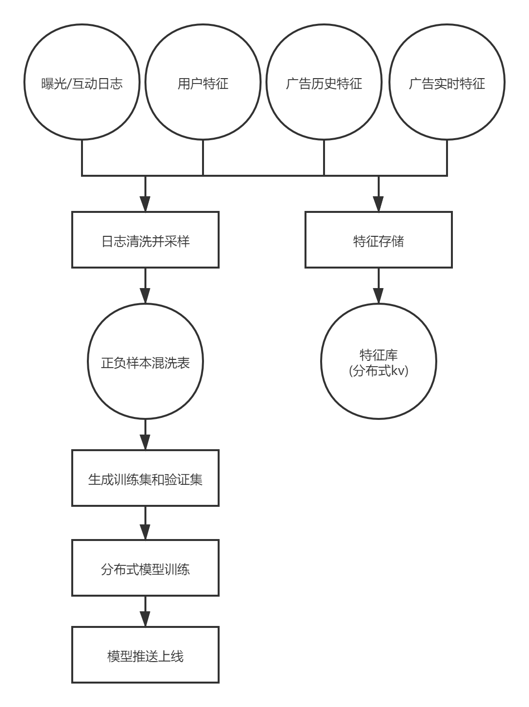
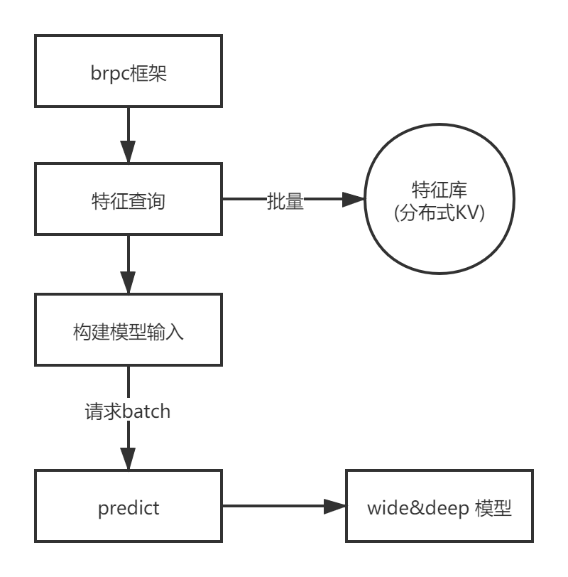

# 基于 wide&deep 模型的广告排序服务
## 前言
粉丝头条广告，采用 wide&deep 模型对召回广告进行社交互动预估，并基于预估的 ctr 得分进行排序，属于粗排模块。

## wide&deep 简介
wide&deep 是 LR 和 DNN 两个模型的融合，使得它既有 LR 的记忆能力，又有 DNN 的泛化能力。

适用于输入非常稀疏的大规模分类或回归问题，比如推荐系统、search、ranking 问题，输入稀疏通常是由离散特征有非常非常多个可能的取值造成的，one-hot之后维度非常大。

### wide 部分
采用 LR 模型，通过 one-hot 编码构建离散特征，训练出每个特征的权重，由于是线性模型，具备很强的记忆性和可解释性。

LR 需要通过特征交叉来提高模型的表达能力，增加了特征工程的工作量。LR 模型学习不到从未出现过的特征组合，不具备泛化能力。

### deep 部分
采用 DNN 模型，可以为每个特征学习到一个低维稠密向量（embedding），减轻了特征工程的负担。学习的特征向量包含了任意特征之间的远近关系，包括训练样本中从未出现过的特征组合，这样模型就具备了泛化推理能力。

当 embedding 矩阵稀疏且高秩时，很难非常效率的学习出低维度的表示（如 user 有特殊的爱好或 item 比较小众），从而可能过度泛化，给出完全不相关的推荐，准确性不能得到保证。

### 联合训练
将 LR 和 DNN 联合训练，二者的输出通过加权方式合并到一起，并通过 logistic loss function 进行最终输出。在训练的时候，根据最终的 loss 计算出梯度，反向传播到 Wide 和 Deep 两部分中，分别训练自己的参数。

联合训练下 wide 和 deep 的 size 都减小了，wide 只需要填补 deep 的不足就行，只需要较少的交叉特征，不需要全部。

### 优化器
wide 部分是用 FTRL（Follow-the-regularized-leader） + L1 正则化学习。

deep组件是用 AdaGrad 来学习。

## 模型训练
### 模型训练流程图

- 每天定时执行日志清洗任务，将当天的曝光和互动日志分别作为正负样本，按照 10:1 的比例生成到正负样本混洗表中。
- 每天定时执行样本生成任务，从正负样本混洗表中，选取最近30天的数据导出到 HDFS 指定路径下，作为训练集，从训练集中截取一小部分作为验证集。
- 提交分布式训练任务，训练模型。
- 模型训练完成后，将最近训练的 5 个 checkpoint 中 auc 最高的那个模型推送到线上服务指定路径下。

## 线上预估
### 线上预估服务架构图

- 使用 brpc 框架取代原生的 tensorflow-serving。
- 收到投放引擎的 predict 请求后，首先根据用户 uid 和广告ID 去 laser 特征数据库中查询模型调用的各种特征。
- 根据模型格式要求，将特征拼接成调用模型的参数，支持通过 batch_size 并行处理多个广告，这里最大为 400.
- 调用 tensorflow 框架提供的 pridict() 方法，获取预测得分，tensorflow底层采用线程池支持多核处理。
