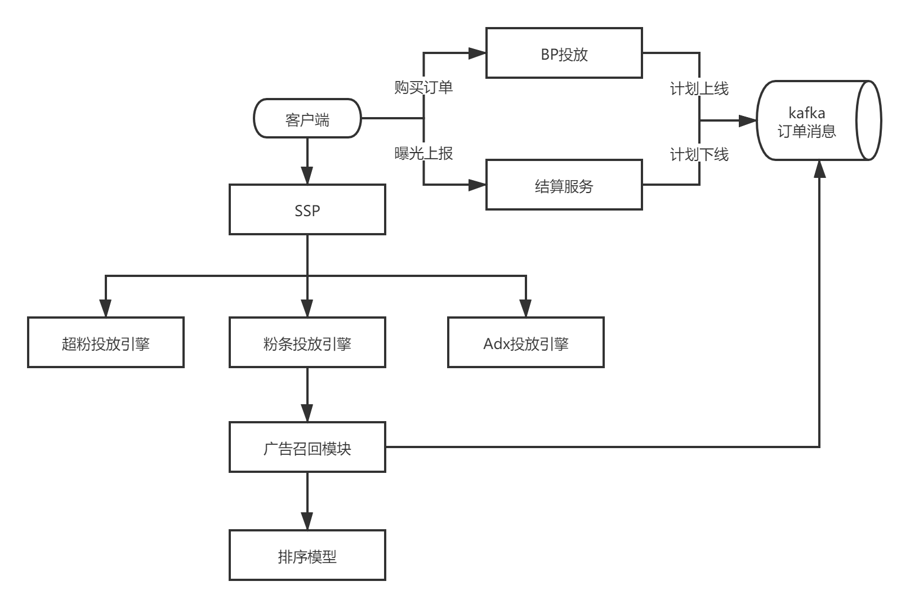
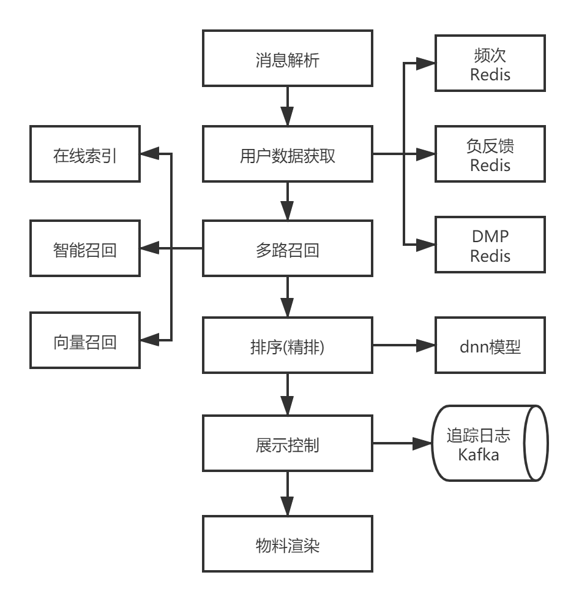

# 粉丝头条广告技术架构
## 前言
粉丝头条是微博面向 C 端用户提供的博文推广服务，用户在客户端创建推广计划并付费，目标博文会以粉丝头条的形式投放推广。

粉丝头条的目标受众包括自己的粉丝，以及推广给更多其他用户，营销目标分为增长粉丝、增加互动（转发、评论、点赞）。

粉丝头条广告的特点：
- 面向 C 端用户
- 定价保量
- 侧重效果
- 小订单多

## 系统架构
### 广告整体架构

#### BP投放
提供用户直接操作的界面，可以选择订单的预算量，定向条件，营销目标等。

#### Idx
流量分发引擎，它负责将用户流量根据售卖规则并行分发给不同产品线引擎，并对各个产品线返回的广告候选进行竞价。

#### 超粉引擎
面向 B 端用户的广告投放引擎，提供更精细化的投放和报表服务。

#### 结算服务
实时计费服务，接收端上的真实曝光和互动数据并进行实时扣费，预算耗尽时，对计划进行下线操作。

### 粉条投放引擎架构

#### 多路召回
召回阶段就是对候选广告进行海选，召回策略可以有多种，使得选中的广告具备多样性。

##### 定向索引
针对使用精准定向的广告，实现相关性检索，根据本次请求的用户和上下文信息，筛选出符合定向条件的广告。

##### 智能召回
针对使用智能优选的广告，采用 wide&deep 模型实现召回，减少特征的数量和 deep 部分的网络层数，使模型尽量简单高效。

##### 向量召回
针对使用智能优选的广告，采用 DSSM 双塔模型训练出用户和广告向量特征，通过余弦计算得到用户和广告的相关度。

#### 过滤
通过频次、负反馈对广告候选进行过滤，提升用户体验。

#### 排序
一般排序模型又分为粗排和精排，粗排使用一些简单的模型或者策略，降低候选数量（低于100），精排则采用复杂的深度模型计算。

##### 粗排
粉丝头条广告在粗排阶段没有再采用其他机器学习模型，而是结合平滑（pacing）算法，维护一个召回模型的点击率阈值，通过阈值来过滤掉相关性低的广告，达到降低候选数量的目的。

##### 精排
采用 DNN 深度模型，使用更多的特征，更复杂的网络结构，提升预测效果。
