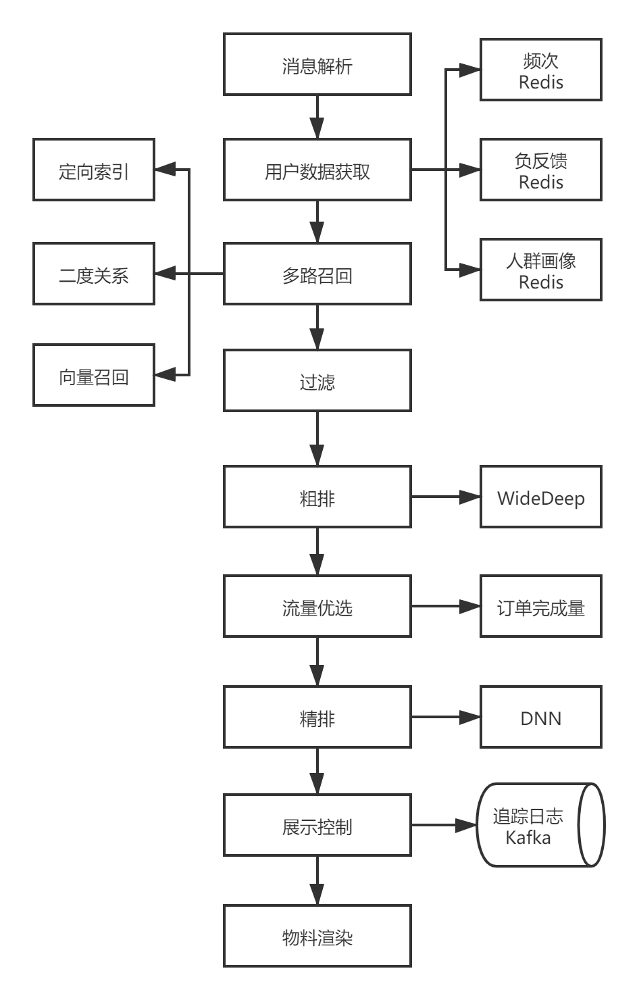

# 粉丝头条广告技术架构
## 前言
粉丝头条是微博面向 C 端用户提供的博文推广服务，用户在客户端创建推广计划并付费，目标博文会以粉丝头条的形式投放推广。

粉丝头条的目标受众包括自己的粉丝，以及推广给更多其他用户，营销目标分为增长粉丝、增加互动（转发、评论、点赞）。

粉丝头条广告的特点：
- 面向 C 端用户
- 定价保量
- 侧重效果
- 小订单多

## 系统架构
### 广告整体架构

#### BP投放
提供用户直接操作的界面，可以选择订单的预算量，定向条件，营销目标等。

#### Idx
流量分发引擎，它负责将用户流量根据售卖规则并行分发给不同产品线引擎，并对各个产品线返回的广告候选进行竞价。

#### 超粉引擎
面向 B 端用户的广告投放引擎，提供更精细化的投放和报表服务。

#### 结算服务
实时计费服务，接收端上的真实曝光和互动数据并进行实时扣费，预算耗尽时，对计划进行下线操作。

### 粉条投放引擎架构

#### 多路召回
召回阶段就是对候选广告进行海选，采用多路召回，可以提高召回的多样性和容错性。

##### 定向索引
针对精准定向的广告，实现相关性检索，根据本次请求的用户和上下文信息，筛选出符合定向条件的广告。

##### 二度关系
针对智能优选的广告，利用关注关系，在图数据库 hugeGraph 中挖掘二度关系用户（粉丝的粉丝），并建立倒排索引用于召回。

##### 向量召回
针对智能优选的广告，采用 DSSM 双塔模型训练出用户和广告向量特征，通过余弦相似度计算进行召回。

#### 过滤
通过频次、负反馈对广告候选进行过滤，提升用户体验。

#### 排序
一般排序模型又分为粗排和精排，粗排使用一些简单的模型或者策略，降低候选数量（低于100），精排则采用复杂的深度模型计算。

##### 粗排
采用 Wide&Deep 模型实现粗排，Wide 部分采用少量交叉特征，Deep 部分使用较小的网络层级和 size，使得模型简单高效。

##### 流量优选
基于粗排得到的 ctr 值，利用预算 pacing 算法，实现广告对流量的优选。

##### 精排
采用 DNN 深度模型，使用更多的特征，更复杂的网络结构，提升预测效果。

### 分布式设计

- 广告投放引擎采用 golang 实现，充分利用 goroutine 的并发优势，服务框架采用 gin ，支持多种中间件嵌入（限流、反作弊等）。

- 下游核心模块（召回、排序）均使用 brpc 框架，并注册到 consul 集群，实现服务发现和治理。

- 广告投放引擎通过 consul 集群发现下游服务节点，并实现加权随机的负载均衡算法。

### 高可用设计
广告系统和收入密切相关，对可用性要求很高，系统正常运行时间要求达到 99.99%。

#### 平滑重启
使用 Facebook 开源的 gracehttp 实现平滑重启，避免版本升级过程中导致的不可用。

#### 故障转移
采用 consul 进行服务治理，上游模块实时监控注册到 consul 的下游模块状态变化，自动摘除下游故障节点，实现故障转移。

#### 熔断
访问下游模块时，要增加熔断机制，设定一个失败率阈值，当达到阈值时触发熔断，被熔断的下游服务不会再收到请求，当等待一段时间后，会试探性发起请求，如果请求正常返回，则认为下游服务回归正常，解除熔断。

#### 限流
设定一个最大的 QPS 阈值，超过这个阈值时，直接返回上游一个错误消息。

限流和熔断都是使用阿里开源的 Sentinel 来实现的。

#### 降级
上游模块执行降级处理，将不重要的广告位（比如评论流）下掉，保证重要位置（热门流）能正常投放。

### 监控管理
对系统运行的业务指标和性能指标进行实时监控，并对异常数据进行报警。

### Prometheus + Grafana
用 Prometheus 定时调用应用的 metric 接口采集时序数据，由于 Prometheus 的监控页面比较简单，可以使用 Grafana， 通过 PromQL 语言查询 Prometheus 中存储的数据，在 Grafana 上进行展示。

### Graphite + Grafana
Graphite 是和 Prometheus 类似的一个监控工具，一些需要长期存储的监控使用此方案。
