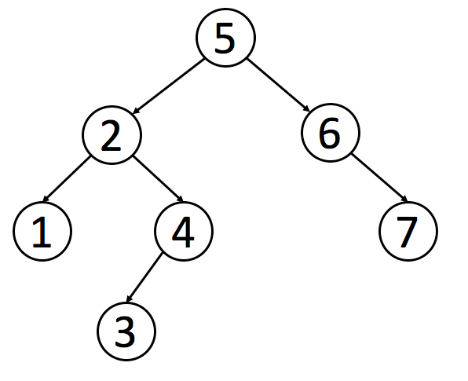

# 二叉搜索树详解
## 概述
二叉搜索树（Binary Search Tree，简称 BST）的定义是：一个二叉树中，任意节点的值要大于等于左子树所有节点的值，且要小于等于右边子树的所有节点的值。

二叉搜索树的查找时间复杂度不确定，在 O(logn) ~ O(n) 之间，当为平滑二叉树（AVL）时查找效率最好，当节点全部在左或全部在右时，退化为链表，查找效率最差。



## BST 操作
### 合法性验证
验证一颗树是否为 BST，注意不能仅仅判断单个节点的左右子树满足大小就认为合法，BST 必须是满足任意节点大于所有左子树节点，且小于所有右子树节点。

解决思路是：中序遍历，然后验证每个节点都大于等于前一个节点
```
int last_value = INT_MIN;
bool isValidBST(TreeNode* root) {
	if (!root)
		return true;
	
	if (!isValidBST(root->left))
		return false;
	
	if (root->value < last_value)
		return false;
	else
		last_value = root->value;
		
	return isValidBST(root->right);
}
```
### 查找
判断一个值在 BST 中是否存在，根据 BST 左右子树的特点进行二分查找
```
bool isInBst(TreeNode* root, int target) {
	if (root == NULL)
		return false;
	
	if (root->value > target)
		return isInBst(root->left, target);
	else if (root->value < target)
		return isInBst(root->right, target);
	else
		return true;
}
```

### 插入
插入操作时找到满足大小的叶子节点，进行插入
```
TreeNode* insertBST(TreeNode* root, int target) {
	if (root == NULL)
		return new TreeNode(target);
	
	if (root->value >= target)
		root->left = insertBST(root->left, target);
	else
		root->right = insertBST(root->right, target);
    
	return root;
}
```
### 删除
```
TreeNode* deleteBST(TreeNode* root, int target) {
	if (!root)
		return NULL;
	
	// 返回节点
	TreeNode* node = root;
	
	if (root->val > target) {
		root->left = deleteBST(root->left, target);
	} else if (root->val < target) {
		root->right = deleteBST(root->right, target);
	} else {
		// 找到删除节点
		if (!root->left) {
			node = root->right;
		} else if (!root->right) {
			node = root->left;
		} else {
			// 
			
			
			// 左右子树都存在，找到左子树的最右侧那个节点
			TreeNode* tmp_node = root->left;
			while (tmp_node->right)
				tmp_node = tmp_node->right;
			
			// 方法1：将右子树直接挂到左子树上；该方法效率最高，但是会破坏树的平衡结构
			node = root->left;
			tmp_node->right = root->right;
			
			// 方法2：将左子树最右侧节点value拷贝给要删除节点，并删除左子树最右侧那个节点；该方法效率不高
			root->value = tmp_node->value;
			root->left = deleteBST(root->left, tmp_node->value);
		}
		
		// 执行删除
		delete root;
	}
	return node;
}
```
