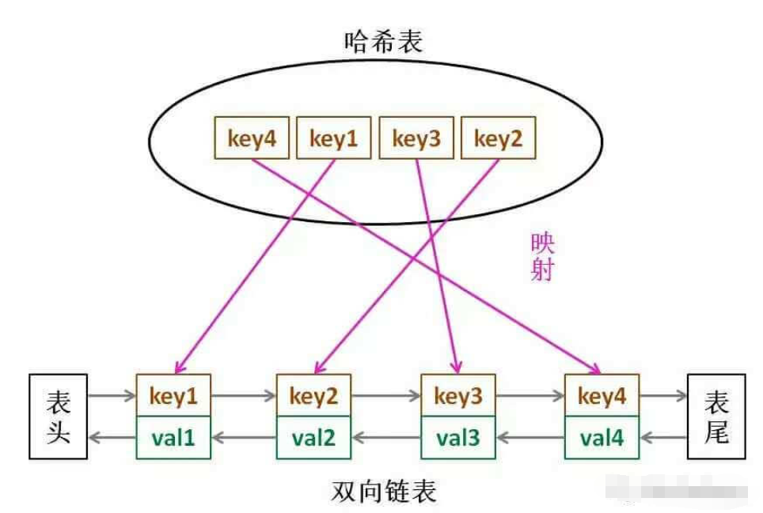

# LRU 缓存实现
## LRU 概述
LRU 的全称是 Least Recently Used，也就是说我们认为最近使用过的数据应该是是「有用的」，很久都没用过的数据应该是无用的，内存满了就优先删那些很久没用过的数据。

## 算法设计
### 方法
- 查找：基于 key 查找元素的值，满足O(1) 时间复杂度
- 插入：插入一个 key-value 对，满足O(1) 时间复杂度

### 约束条件
缓存内存大小有限，当内存满的时候，需要启动 LRU 淘汰机制，淘汰掉最近没有使用过的元素。

### 数据结构
LRU 缓存算法的核心数据结构就是 哈希表 + 双向链表，哈希表用来满足 O(1) 时间复杂度查找和和插入，但是哈希表是无顺序的，LRU 需要一个顺序表表示元素的访问顺序，双向链表可以满足 O(1) 时间复杂度从头尾插入和删除元素。


## LRU 源码实现
```
class LRUCache {
    // key -> iterator to pair(key, val) in the list
    unordered_map<int, list<pair<int, int>>::iterator> map;
    
    // pair(k1, v1) <-> pair(k2, v2)...
    list<pair<int, int>> cache;
    
    // 最大容量
    int cap;
public:
    LRUCache(int capacity) : cap(capacity) {}
    
    int get(int key) {
        if(map.find(key) == map.end()) {
            return -1;
        }
        
        int val = map[key]->second;
        
        // 利用 put 方法把该数据提前
        put(key, val);
        
        return val;
    }
    
    void put(int key, int value) {
        pair<int, int> x = {key, value};
        
        if(map.find(key) != map.end()) {
            
            // 删除旧的节点
            cache.erase(map[key]);
            // 新的插到头部
            cache.emplace_front(x);
            
            // 更新 map 中对应的数据
            map[key] = cache.begin();
            
        } else {
            
            if(cap == cache.size()) {
                // 删除链表最后一个数据
                pair<int, int> last = cache.back(); cache.pop_back();
                
                map.erase(last.first);
            }
            
            // 直接添加到头部
            cache.emplace_front(x);
            map[key] = cache.begin();
            
        }
    }
};
```
