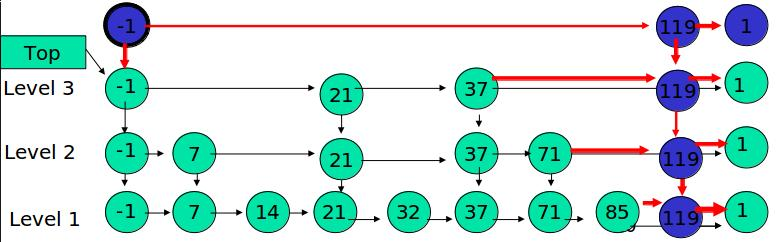
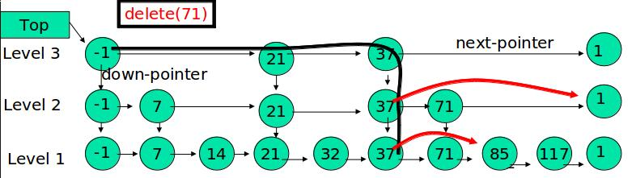

# 跳跃表(skip list)详解

### 跳表概述
跳表是一种查找结构，采用多级有序链表实现，平均时间复杂度为O(logN)，在性能上和红黑树不相上下，很多场合下可以取代红黑树。

跳表和红黑树的比较
- 跳表和红黑树的插入、删除、查找效率都是O(logN)，都可以顺序遍历所有元素（红黑树通过中序遍历）。
- 红黑树更稳定一些，跳表恶化是存在概率的，虽然概率极低。
- 跳表实现简单，但是浪费了一些空间(由于存的指针其实可以忽略不计)。红黑树实现麻烦，但是没有使用额外的空间。
- 跳表区间范围查找操作简单，redis中的zset实现区间查找就是用的跳表。

开源软件使用跳表
- Redis中的有序集合zset。
- LevelDB、RocksDB、HBase中Memtable。

### 跳表的实现
#### 跳表结构

图中-1表示 INT_MIN 链表的最小值，1 表示 INT_MAX 链表的最大值。


- 由很多层结构组成

- 每一层都是一个有序的链表

- 最底层(Level 1)的链表包含所有元素

- 如果一个元素出现在 Level i 的链表中，则它在 Level i 之下的链表也都会出现。

- 每个节点包含两个指针，一个指向同一链表中的下一个元素，一个指向下面一层的元素。


#### 跳表的搜索
- 从最上层查找，找到离目标值最近的比他小的节点，顺着这个节点找下一层
- 依次类推，直到找到最底层，最底层链表包含全部元素。


#### 跳表的插入
- 先确定该元素要占据的层数 K,采用丢硬币的方式，这完全是随机的，初始k为1，丢到正面就加1，丢到反面就结束，k的期望值是2。
- 然后在 Level 1 ... Level K 各个层的链表都插入元素。


- 如果 K 大于链表的层数，则要添加新的层。



#### 跳表的删除
- 在每一层都找到目标节点，并全部删除掉



### 复杂度分析
#### 最坏场景
当每个元素随机到的高度都是k的时候，查找、插入、删除的性能最差，为O(n+k), n为跳表的元素数目，k为跳表高度, 从这一点看，跳表没有红黑树稳定。

#### 查找时间推导（插入、删除类似）
查找包括两个循环，外层循环是从上层Level至底层Level，内层循环是在同一个Level，从左到右。

因跳表高度以极大概率为O(logn)，所以外层循环的次数以极大概率为O(logn)。

在上层查找比对过的key，不会再下层再次查找比对，任意一个Key被查找比对的概率是1/2, 因此内层循环的比对次数的期望约等于2，即O(1)。最终查找的时间=O(1)*O(logn)，也即O(logn)。

### 源码实现
#### 跳表结构定义
```
typedef struct node    //每个节点的数据结构
{
    keyType key;       // key值
    valueType value;   // value值
    struct node *next[1];  // 后继指针数组，柔性数组 可实现结构体的变长
} Node;

typedef struct skip_list    //跳表结构
{
    int level;    // 最大层数
    Node *head;   //指向头结点
} skip_list;
```

#### 插入
```
//插入元素的时候元素所占有的层数完全是随机算法
int randomLevel()
{
    int level=1;
    while (rand()%2)
        level++;
    level=(MAX_L>level)? level:MAX_L;
    return level;
}
/*
step1:查找到在每层待插入位置,跟新update数组
step2:需要随机产生一个层数
step3:从高层至下插入,与普通链表的插入完全相同。
*/
bool insert(skip_list *sl, keyType key, valueType val)
{
    Node *update[MAX_L];
    Node *q=NULL,*p=sl->head;//q,p初始化
    int i=sl->level-1;
    /******************step1*******************/
    //从最高层往下查找需要插入的位置,并更新update
    //即把降层节点指针保存到update数组
    for( ; i>=0; --i)
    {
        while((q=p->next[i])&& q->key<key)
        p=q;
        update[i]=p;
    }
    if(q && q->key == key)//key已经存在的情况下
    {
        q->value = val;
        return true;
    }
    /******************step2*******************/
    //产生一个随机层数level
    int level = randomLevel();
    //如果新生成的层数比跳表的层数大
    if(level>sl->level)
    {
        //在update数组中将新添加的层指向header
        for(i=sl->level; i<level; ++i)
        {
            update[i]=sl->head;
        }
        sl->level=level;
    }
    //printf("%d\n", sizeof(Node)+level*sizeof(Node*));
    /******************step3*******************/
    //新建一个待插入节点,一层一层插入
    q=create_node(level, key, val);
    if(!q)
      return false;

    //逐层更新节点的指针,和普通链表插入一样
    for(i=level-1; i>=0; --i)
    {
      q->next[i]=update[i]->next[i];
      update[i]->next[i]=q;
    }
    return true;
}
```

#### 删除
```
bool erase(skip_list *sl, keyType key)
{
    Node *update[MAX_L];
    Node *q=NULL, *p=sl->head;
    int i = sl->level-1;
    for(; i>=0; --i)
    {
        while((q=p->next[i]) && q->key < key)
    {
       p=q;
    }
        update[i]=p;
    }
    //判断是否为待删除的key
    if(!q || (q&&q->key != key))
        return false;

  //逐层删除与普通链表删除一样
    for(i=sl->level-1; i>=0; --i)
    {
        if(update[i]->next[i]==q)//删除节点
        {
            update[i]->next[i]=q->next[i];
            //如果删除的是最高层的节点,则level--
            if(sl->head->next[i]==NULL)
                sl->level--;
        }
    }
    free(q);
    q=NULL;
    return true;
}
```

#### 查找
```
valueType *search(skip_list *sl, keyType key)
{
    Node *q,*p=sl->head;
    q=NULL;
    int i=sl->level-1;
    for(; i>=0; --i)
    {
        while((q=p->next[i]) && q->key<key)
        {
            p=q;
        }
        if(q && key==q->key)
            return &(q->value);
    }
    return NULL;
}
```
