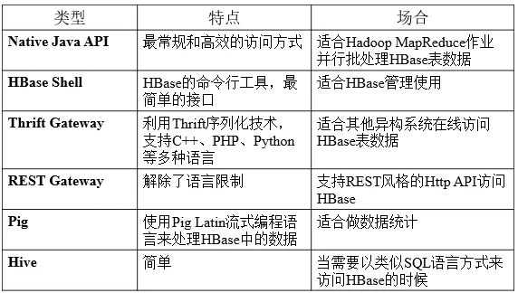
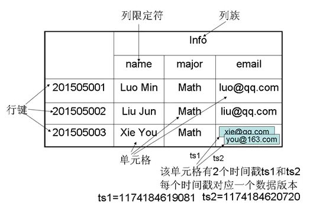
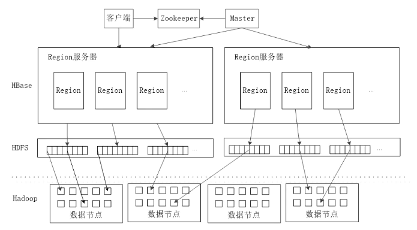
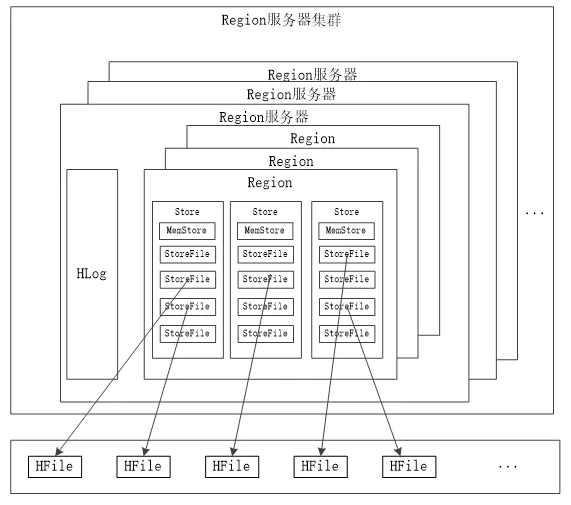

# HBase 详解
## 概述
HBase 是一个开源的非关系型分布式数据库，它参考了谷歌的 BigTable 建模，实现的编程语言为 Java。

它是 Apache 的 Hadoop 项目的一部分，运行于 HDFS 文件系统之上，为 Hadoop 提供类似于 BigTable 规模的服务。

HBase 是一个高可靠、高性能、面向列、可伸缩的分布式数据库，是 BigTable 的开源实现，主要用来存储非结构化的松散数据。

HBase 的目标是利用廉价计算机集群处理由超过 10亿 行数据和数百万列元素组成的数据表。

### Hbase 特点
- 容量大：一个表可以有数十亿行，数百万列。
- 无模式：每行都有一个可排序的主键(row_key)，和任意多的列，同一张表的不同行可以有截然不同的列。
- 面向列：面向列的存储和权限控制，列独立检索。
- 多版本：每个单元中的数据可以有多个版本，默认情况下版本号自动分配，是单元格插入时的时间戳。
- 数据类型单一：所有数据都是字符串类型。
- 较低的时延：读写平均时延在 20ms 左右，hbase 适用于延迟要求不高的实时查询，和 rocksdb（时延小于 1ms）有不少差距，

## Hbase 访问接口

## Hbase 数据模型

- 表：HBase 采用表来组织数据，表由行和列组成，列划分为若干列族。
- 行：每个 HBase 表都由若干行组成，每个行由行键（row key）来标识。
- 列族：一个 HBase 表被分组成许多“列族”（Column Family）的集合，它是基本的访问控制单元。
- 列限定符：列数据通过“列簇：列标限定符（或列）”来定位。创建表的时候不需要指定列限定符，读写的时候需要指定。
- 单元格：在 HBase 表中，通过行、列族和列限定符确定一个“单元格”（cell），单元格中存储的数据没有数据类型，总被视为字节数组byte[]
- 时间戳：每个单元格都保存着同一份数据的多个版本，这些版本采用时间戳进行索引。

## Hbase 实现原理
### 主要功能组件
- 一个 master 主服务器
- 许多 Region 服务器
- zookeeper 服务器

主服务器 Master 负责管理和维护 Hbase 表的分区信息，维护 Region 服务器列表，分配 Region，负载均衡。

Region 服务器负责存储和维护分配给自己的 Region，处理来自客户端的读写请求。

Zookeeper 可以帮助选举出一个 Master 作为集群的总管，并保证在任何时刻总有唯一一个 Master 在运行，这就避免了 Master 的“单点失效”的问题。

### 客户端逻辑
- 客户端并不是直接从 Master 主服务器上读取数据，而是在获得 Region 的存储位置信息后，直接从 Region 服务器上读取数据。
- 客户端并不依赖 Master，而是通过 Zookeeper 获取 Region 位置信息，大多数客户端甚至从来不和 Master 通信，这种设计方式使得 Master 负载很小。

### Hbase 系统架构

#### Region 的定位
- 客户端通过 zookeeper 服务查询到哪台 Region 上保存右 hbase:meta 表，hbase-meta 表保存了所有 Region 的 row_key 范围和服务器地址。
- 客户端查询到 hbase-meta 表，通过 key 查找到对应的 Region 节点地址，并直接对其进行操作。
- 客户端会将 meta 表缓存到本地，当 key 不在缓存范围时，会更新 meta 表。

#### Region服务器工作原理

#### 用户读写数据过程
- 用户写入数据时，被分配到相应Region服务器去执行。
- 用户数据首先被写入到MEMStore和Hlog中。
- 只有当操作写入Hlog之后，commit()调用才会将其返回给客户端。
- 当用户读取数据时，Region服务器首先访问MEMStore缓存，如果找不到，再去磁盘上面的StoreFile中寻找。

#### 缓存的刷新
- 系统会周期性地把MemStore缓存里的内容刷写到磁盘的StoreFile文件中，清空缓存，并在Hlog里面写入一个标记
- 每次刷新都生成一个新的StoreFile文件，因此，每个Store包含多个StoreFile文件。
- 每个Region服务器都有一个自己的HLog文件，每次启动都检查该文件，确认最近一次执行缓存刷新操作之后是否发生新的写入操作；如果发现更新，则先写入MemStore，再刷写到StoreFile，最后删除旧的Hlog文件，开始为用户提供服务。

#### StoreFile 合并
- 每次刷写都生成一个新的StoreFile，数量太多，影响查找速度、
- 调用Store.compact()把多个合并成一个
- 合并操作比较耗费资源，只有数量达到一个阈值才启动合并
