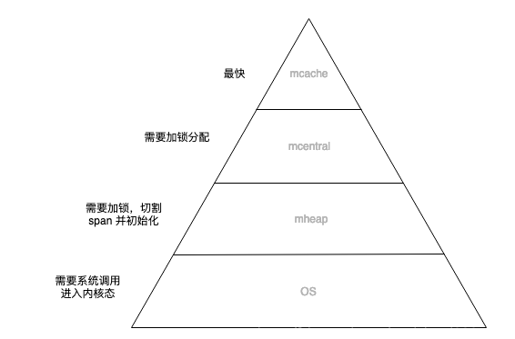

# golang 内存管理

## 内存逃逸
golang 程序在定义一个变量时，编译器会对变量的生命周期进行分析，如果变量只在当前函数体内部被引用，则分配在栈上，否则就说该变量发生了“逃逸”，需要分配到堆上。

golang 变量分配到堆上还是栈上，不由任何关键字来决定（比如 make，new 也可能分配到栈上），只由编译器对代码做逃逸分析决定。

通常情况下，编译器是倾向于将变量分配到栈上的，因为它的开销小，最极端的就是"zero garbage"，所有的变量都会在栈上分配，这样就不会存在内存碎片，垃圾回收之类的东西。

### 逃逸分析
golang 的逃逸分析是决定变量分配到堆上还是栈上的过程，发生在编译期。

#### 查看变量逃逸
```
go build -gcflags '-m’
```

#### 变量逃逸场景
- 全局变量。
- 变量申请的内存超过 goroutine 的栈空间（2k）。
- 在方法内把局部变量指针返回，造成外部引用。
- 发送指针或带有指针的值到 channel 中。
- 在一个切片上存储指针或带指针的值， slice 的底层数据在 append 时会在堆上分配。
```
func Test() *int {
    val := 10
    return &val // Test函数调用结束，val仍然被引用，发生逃逸，分配在堆上
}

func Test1(data *Data) {
    obj := Object{}
    data.Obj = &obj // obj发生逃逸，分配在堆上
}

func Work() {
    data := Data{}
    Test1(&data) // 虽然传递指针，但不逃逸，data分配在栈上，work函数调用结束，data没有其他地方引用
}

func Work() {
    data := Data{}
    go func() {
        data.Val = "" // data发生逃逸，因为work调用结束，协程可能还在运行，所以data需要分配在堆上
    }
}
```

## 内存分配
golang 的内存分配算法主要源自 google 为 c 语言开发的 tcmalloc 算法，全称 thread-caching malloc。

golang 的内存分配算法是在 tcmalloc 基础之上做的优化。

### tcmalloc
主要解决多线程下内存分配效率问题，核心思想就是把内存分为多级管理，从而降低锁的粒度。

每个线程都会自行维护一个独立的内存池，进行内存分配时优先从该内存池中分配，当内存池不足时才会向全局内存池申请，以避免不同线程对全局内存池的频繁竞争。

### golang 内存分配
go 程序启动的时候，会先向操作系统申请一块内存（虚拟的地址空间），切成小块后自己进行管理。

#### 内存管理单元
golang 内存管理的基本单元是 mspan，是由一片连续的 8KB 的页组成的大块内存。

mspan 内部会划分出若干个不同大小的 object，每个 object 可存储一个对象，mspan 会分配给和 object 尺寸大小接近的对象。

#### 内存管理组件
mcache, mcentral, mheap 是Go内存管理的三大组件，层层递进。
- mcache 管理线程在本地缓存的 mspan，每个 P 拥有一个 mcache，所以是无锁访问，小对象直接从 mcache 分配。
- mcentral 是所有线程共享，需要加锁访问，mcache 内存不足时，会向 mcentral 申请访问。
- mheap 主要用于大对象的内存分配，以及管理未切割的 mspan，用于给 mcentral 切割成小对象。



#### 分配流程
- 小于 16B 的对象，使用 mcache 的 tiny 分配器分配。
- 16B ~ 32KB 的对象，使用 mcache 中相应规格大小的 mspan 分配，如果 mcache 没有相应规格的 mspan，则向 mcentral 申请。
- 大于32KB 的对象，直接从 mheap 上分配，如果 mheap 中也没有合适大小的 mspan，则向操作系统申请。

## 垃圾回收 
golang 会定时释放不再使用的内存对象，叫做垃圾回收（GC），golang 在 1.5 版本之后采用 “三色标记法” 实现垃圾回收。

### 标记清除
GC 的核心思想就是先标记，再清除
- 标记阶段：从根对象开始扫描，对所有可达的内存对象进行标记，被标记的对象代表被其他对象引用。
- 清除阶段：扫描堆上的所有内存对象，对未被标记的内存对象进行回收，这里是将内存还给内存分配单元。

标记阶段需要通过 STW 挂起所有运行的 goroutine，防止标记过的对象在清除阶段开始前又引用了新的对象，造成新对象没有被标记，在清除阶段被误删除。

STW 会造成系统延迟，是 GC 的主要开销，所以 goalng 对 GC 的优化主要就是降低 STW 的时间。

### 根对象
golang 通过有向图代表各个对象的引用关系，只引用别人，而自己没有被引用的对象就是根对象，全局变量都是根对象。

对象可达是指引用它的对象也是可达的，如果引用他的对象不存在了（比如栈回收），则该对象变的不可达，需要在 GC 时回收。

### 三色标记法
三色标记法通过开启写屏障，减少了 STW 的时间，让用户程序 和 GC 几乎同时进行，减少 GC 造成的系统延迟。

标记中面对的问题是，GC 和程序同时运行，对象 A 被标记完成后，又引用了新对象 B，对象 B 没有办法再被标记，导致被清除。

解决办法是在 GC 中开启写屏障，将新产生的引用对象保存下来，标记完成后，开启 STW 再对写屏障新增对象再次标记，防止误删除。
由于 GC 中新产生的引用对象很少，所以 STW 的时间很短，对系统造成的延迟也很小。

#### 写屏障
写屏障（Write barrier）是编译器在写操作的前面，生成的一小段代码段，来确保不要打破一些约束条件。

写屏障负责将 GC 标记过程中新产生的对象和引用保存下来，并等待 GC 处理。

写屏障会让写操作变的复杂，在一定程度上也会影响系统的吞吐量。

#### 三色和状态
- 白色：初始状态，如果标记完成还是白色那就代表对象不可达，要清除回收。
- 灰色：可达对象的中间状态，等待扫描它的子对象。
- 黑色：可达对象的最终状态，子对象扫描标记完成。

#### 标记阶段
- 初始化写屏障，用来收集 GC 扫描过程中，用户程序新产生的对象及引用变化。
- 访问根对象集合，将根对象标记为灰色，放入一个栈中。
- 从栈中取出一个对象，并把该对象所有引用的子对象入栈，并标记为灰色，并且把该对象标记为黑色，则该对象标记完成。
- 无限重复处理，只到栈为空，所有灰色对象扫描完成标记为黑色。
- 执行 STW，标记写屏障产生的灰色对象，并关闭写屏障。

#### 清除阶段
清除阶段会扫描堆内存，并回收白色对象，这里不必 STW，因为白色对象不可达，就不可能再被任何对象引用到，可以放心清除。

清除时有可能产生新的对象，新创建的对象默认是白色的，有可能被清除。解决办法扫描清除的位置是知道的，程序创建新对象时，如果对象位置在扫描前，可以不用管，不会被清除，如果在扫描后面，则直接由用户程序标记为黑色。

#### 触发 GC 时机
- 主动触发，通过调用 runtime.GC() 来触发 GC，此调用在 GC 任务完成之后才返回。
- 被动触发：系统监控到两分钟内没有产生任何 GC，强制触发 GC；使用 Pacing 算法，其核心思想是控制内存增长的比例。

申请速度超过GC
找到内存分配过快的goroutine，暂停内存分配，转而去执行标记任务，加快GC速度。

### GC 性能调优
GC 对性能的影响主要关注两个指标：cpu 利用率和 GC 停顿时间。

golang 没有提供关于 GC 的调优参数，通常说的 GC 调优，都是指优化用户代码，减少堆对象申请，降低 GC 压力。
- 采用对象池，降低并复用已经申请的内存，比如使用sync.Pool。
- 降低 goroutine 的数目，goroutine 会加重 GC 时标记扫描的负担。
- 合并小对象，尽量将小对象放到一个大结构体里面，方便 GC 扫描标记。
- 少用指针返回，因为指针返回会导致变量逃逸，如果是小对象，可以直接返回对象，通过栈拷贝避免 GC 产生。
- 少用 "+" 连接 string，这样会生成新的对象，好的方式是通过 append() 进行。
- 避免 string 和 []byte 之间的转换，转换时底层会发生拷贝，可以一直使用 []byte，不得已时使用 unsafe.Pointer 直接进行转化。

### GC 导致的程序假死
在 1.13 版本之前，一个 goroutine 如果处于无函数调用的死循环状态，这个 goroutine 会无法被 GC 的 STW 挂起，导致其他 goroutine 都处于等待 GC 状态，程序假死。

在 1.14 版本开始，支持抢占式调度，goroutine 如果处于无函数调用的死循环状态，会被抢占式调度，不会影响 GC，也不会假死。

### 打印 GC
编译时增加 -gcflags 选项
```
go build -gcflags "-l" -o test test.go 
```

运行时通过 GODEBUG 启动
```
GODEBUG="gctrace=1" ./test 
```

结果及分析
```
gc 1 @0.005s 15%: ..., 6->6->6 MB, 4 MB goal, 2 P 
gc 2 @0.016s  8%: ..., 8->8->8 MB, 13 MB goal, 2 P 
gc 3 @0.022s  9%: ..., 14->14->14 MB, 17 MB goal, 2 P 
 
1 表示第一次执行
@0.038s 表示程序执行的总时间
1% 垃圾回收时间占用总的运行时间百分比
0.018+1.3+0.076 ms clock 垃圾回收的时间，分别为STW（stop-the-world）清扫的时间, 并发标记和扫描的时间，STW标记的时间
0.054+0.35/1.0/3.0+0.23 ms cpu 垃圾回收占用cpu时间
4->4->3 MB 堆的大小，gc后堆的大小，存活堆的大小
5 MB goal 整体堆的大小
4 P 使用的处理器数量
```


