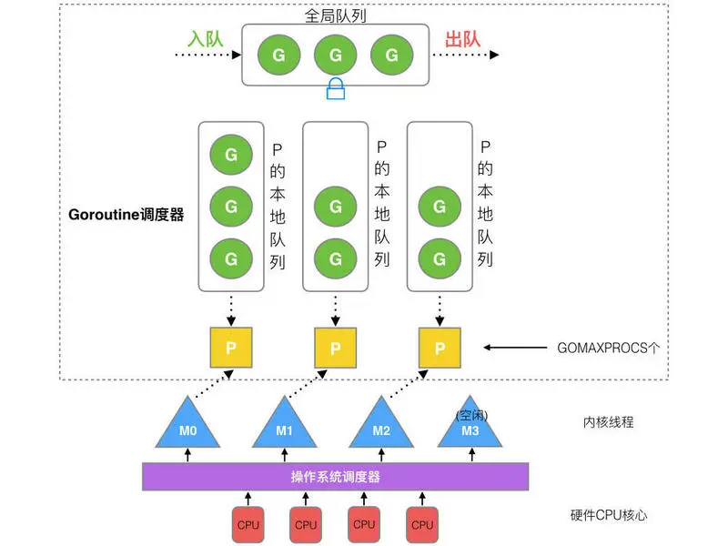

# 详解 golang 调度原理
## 前言
golang 原生支持语言级并发，这里的并发是指允许多个任务同时执行，但实际上并不一定在同一时刻被执行，多任务在同一时刻被执行叫并行，并行依赖多核处理器资源。

golang 通过在多个 goroutine 之间调度来实现并发，并利用多核实现并行。

## goroutine
```
go func() {
        fmt.Println("Hello,World!")
}()
```
goroutine 是拥有 2k 栈空间的用户线程，可以理解成任务单元，goroutine 运行在系统线程之上，和系统线程是 M:N 的关系。

goroutine 调度发生在用户态，由 runtime 包实现，上下文切换开销很小，少量的线程就可以支持上百万的并发任务。

## 调度原理
golang 的调度就是为 goroutine 分配执行线程的过程，采用 GMP 模型。

### GMP 模型
#### G
即 goroutine，是一个并发任务单元，它并不是真正的执行体，它只保存任务的状态。其实现是一个类似于 PCB (进程控制块) 的数据结构，其中包含为并发任务执行所需的栈空间，
保存上下文的运行现场结构，goroutine的状态等等。

一个 goroutine 创建之后，就会被放到 P 的本地队列或者全局队列当中，等待被调度执行。

#### M
工作线程（或者 machine ），实际执行的实体。一个 M 和 P 绑定才能够执行 G，通过循环调度的方式不断地从从队列（ P 本地队列或者全局队列）中获取 G 去执行。

M 由调度器按需创建，数量默认不超过1万。

#### P
Processor，一个抽象的处理器，P 为 M 提供需要的上下文，比如：内存分配，本地队列等。

P 数量控制同时运行的线程数量，P 的数量可以调整，默认等于GOMAXPROCS（如果不设置就是默认机器的cpu数量）。

#### 队列
每个 P 都有一个本地队列，本地队列的长度为256，访问本地队列是无锁的（使用atomic.CasRel）。

所有的 P 共享一个全局队列，全局队列的主要作用是负载均衡，访问全局队列需要加锁。

#### GMP 模型图


### 调度过程
#### 启动调度器
调度器的启动是执行 asm_xxx.s 汇编文件。
- 调用 runtime·schedinit 创建 P，P 的个数为 GOMAXPROCS，最大不超过256。
- 调用 runtime·newproc 创建第一个主 goroutine，并调用当前主线程的入口函数 runtime·mstart 运行主 goroutine。
- 主 goroutine 创建一个特殊 sysmon 线程，该线程负责系统监控。 

#### 创建 G
go 关键字在底层调用 runtime·newproc 创建 G，并将 G 优先放入当前 P 的本地队列，如果本地队列已满，则将本地队列的前一半转移到全局队列中。

#### 创建 M
M 线程只能由 runtime 根据实际情况去创建，当有空闲的 P，而且有可运行的 G 时，系统会寻找可用的 M 去执行，如果没有则创建新的 M 去运行。

M 线程的入口函数为 runtime·mstart，先调用 acquirep 绑定1个空闲 P，然后调用 schedule，schedule 是 runtime 的主调度函数。

#### schedule 调度
- M 周期性（61）从全局队列获取可运行的 G，拿不到则从本地队列拿，还拿不到，则调用 findrunnable 去其它 P 中偷取。
- 获取到 G 后，调用 execute 执行 G，执行完成后，会返回到 goexit，在 goexit 中重新执行 schedule 函数，循环调度。
- 获取不到 G，则调用 netpoll 休眠当前线程，并在有新任务时被唤醒重新执行。

#### 阻塞时调度
golang 会将一些特殊的阻塞函数封装成非阻塞，比如 net 库 IO，channel，time.Sleep 等， 这些函在结束时会调用 runtime·park 挂起当前 G, 但不影响 M 继续循环执行其他 G。
当函数返回时，会将挂起的 G 重新放入全局队列，等待调度。

当执行正常系统调用时，当前 M 可能会被阻塞，sysmon 会扫描当发现阻塞的 M，并将该 M 的 P 收回，当 M 返回时，将 G 放入全局队列，并进入休眠状态等待新的 P 。 

#### 抢占式调度
runtime 通过 sysmon 线程监控，保证 G 最多执行 10ms 就会被调度一次。

这样保证 G 不会长时间占用 cpu，可以执行 netpool (获取 fd 事件), retake (抢占), forcegc (按时间强制执行gc), scavenge heap (释放自由列表中多余的项减少内存占用)等处理.
