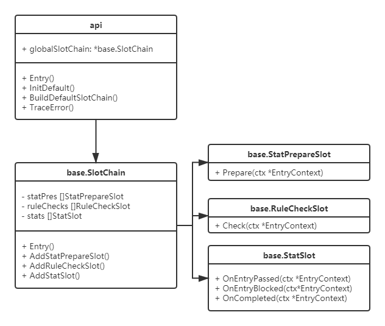

# Sentinel-golang源码解析

## Sentinel简介
[Sentinel](https://github.com/alibaba/sentinel-golang/tree/v0.4.0)是阿里开源的一款轻量级流控框架，从流量控制、熔断降级、系统负载保护等多个维度来帮助用户保护服务的稳定性。

相比于Hystrix，Sentinel的设计更加简单，在 Sentinel中资源定义和规则配置是分离的，也就是说用户可以先通过Sentinel API给对应的业务逻辑定义资源（埋点），然后在需要的时候再配置规则，通过这种组合方式，极大的增加了Sentinel流控的灵活性。

引入Sentinel带来的性能损耗非常小，只有在业务单机量级超过25W QPS的时候才会有一些显著的影响（5% - 10% 左右），单机QPS不太大的时候损耗几乎可以忽略不计。

## 源码解析
### 代码结构


### [api](https://github.com/alibaba/sentinel-golang/tree/v0.4.0/api)
api包面向户程序，提供了使用Sentinel功能的入口函数。

#### 资源访问
Sentinel流控的对象是资源(Resource)，可以把一块内存，一个连接，甚至一段代码作为一个资源进行流控。

```
func Entry(resource string, opts ...EntryOption) (*base.SentinelEntry, *base.BlockError)
func TraceError(entry *base.SentinelEntry, err error) 
```
用户程序在访问资源前，调用api.Entry函数，Sentinel内部会统计该资源的访问信息，并基于统计信息执行规则检查，用户程序只有在检查通过后才能访问资源，如果检查失败，则返回base.BlockError。

用户程序访问资源时，如果访问出错(比如请求超时)，需要调用api.TraceError函数反馈失败信息，用于内部统计。

### [core/base](https://github.com/alibaba/sentinel-golang/tree/v0.4.0/core/base)
#### 插槽
```
type SlotChain struct {
	statPres   []StatPrepareSlot
	ruleChecks []RuleCheckSlot
	stats      []StatSlot
	// EntryContext Pool, used for reuse EntryContext object
	ctxPool sync.Pool
}

func (sc *SlotChain) Entry(ctx *EntryContext) *TokenResult
func (sc *SlotChain) exit(ctx *EntryContext) 
```
Sentinel内部创建了一个全局的SlotChain对象，并提供了响应api.Entry的Entry函数。

SlotChain保存了三种类型的Slot切片
- StatPrepareSlot：用于统计数据的前置处理， 比如统计模块会在前置处理时查找或创建当前资源的StatNode。
- RuleCheckSlot：用于规则检查，包括流量控制，熔断，系统保护等多种规则。
- StatSlot：用于统计资源访问信息。

### [core/stat](https://github.com/alibaba/sentinel-golang/tree/v0.4.0/core/stat)
#### 资源统计
```
type ReadStat interface {
	GetQPS(event MetricEvent) float64
	GetSum(event MetricEvent) int64

	MinRT() float64
	AvgRT() float64
}

type WriteStat interface {
	AddMetric(event MetricEvent, count uint64)
}

type StatNode interface {
	MetricItemRetriever

	ReadStat
	WriteStat

	CurrentGoroutineNum() int32
	IncreaseGoroutineNum()
	DecreaseGoroutineNum()

	Reset()
}

type BaseStatNode struct {
	sampleCount uint32
	intervalMs  uint32

	goroutineNum int32

	arr    *sbase.BucketLeapArray
	metric *sbase.SlidingWindowMetric
}

type ResourceNode struct {
	BaseStatNode

	resourceName string
	resourceType base.ResourceType
	// key is "sampleCount/intervalInMs"
	readOnlyStats map[string]*sbase.SlidingWindowMetric
	updateLock    sync.RWMutex
}
```
ResourceNode对象用来实现资源统计，全局变量resNodeMap，提供从Resource到ResourceNode之间的查找。

数据统计和查询分别由sbase.BucketLeapArray和sbase.SlidingWindowMetric两个对象实现。

StatisticSlot对象实现了StatSlot接口
- OnEntryPassed：记录并发数和通过数。
- OnEntryBlocked：记录失败数。
- OnCompleted：计算资源访问时间并记录，并发数减1。

### [core/flow](https://github.com/alibaba/sentinel-golang/tree/v0.4.0/core/flow)
#### 流量控制
- 控制并发数
- 控制QPS

#### 规则控制器
```
type TrafficShapingCalculator interface {
	CalculateAllowedTokens(node base.StatNode, acquireCount uint32, flag int32) float64
}

type TrafficShapingChecker interface {
	DoCheck(node base.StatNode, acquireCount uint32, threshold float64) *base.TokenResult
}

type TrafficShapingController struct {
	flowCalculator TrafficShapingCalculator
	flowChecker    TrafficShapingChecker

	rule *FlowRule
}
```
规则控制器需要实现TrafficShapingCalculator和TrafficShapingChecker两个接口，前者用于保存规则的阈值，后者执行规则检查。

flow模块定义了两个控制器，对应不同的流控行为
- Reject(拒绝)：资源访问量超过阈值，直接返回失败。
- Throttling(排队)：用于调用者对下游服务的流量控制，根据阈值计算出访问资源的期望时间，并判断当前访问时间是否满足期望，如果不满足则返回失败，并返回一个时间给用户程序排队Sleep。

### [core/circuitbreaker](https://github.com/alibaba/sentinel-golang/tree/v0.4.0/core/circuitbreaker)
#### 熔断器

```
type CircuitBreaker interface {
	// BoundRule returns the associated circuit breaking rule.
	BoundRule() Rule
	// BoundStat returns the associated statistic data structure.
	BoundStat() interface{}
	// TryPass acquires permission of an invocation only if it is available at the time of invocation.
	TryPass(ctx *base.EntryContext) bool
	// CurrentState returns current state of the circuit breaker.
	CurrentState() State
	// OnRequestComplete record a completed request with the given response time as well as error (if present),
	// and handle state transformation of the circuit breaker.
	OnRequestComplete(rtt uint64, err error)
}
```

定义了三种熔断器，对应不同熔断规则：
- 慢调用比例：需要设置访问资源的最大时间，超过这个时间判定为慢调用，当比例超过阈值，触发熔断。
- 错误调用比例：访问资源失败比例超过阈值，触发熔断。
- 错误调用个数：访问资源失败数量超过阈值，触发熔断。

熔断器的入口方法为TryPass，判断熔断器的状态
- 状态为Close：熔断器处于关闭状态，返回成功。
- 状态为Open：熔断器处于打开状态，此时周期性将状态改为HalfOpen，并返回成功，允许用户程序本次访问资源，如果访问失败，熔断器将状态由HalfOpen改为Open，如果成功则改为Close。
- 状态为HalfOpen：熔断器处于半打开状态，代表熔断器正在试探中，资源还不能访问，直接返回失败。

熔断器通过实现OnRequestComplete接口，获取当前资源访问结果，并更新统计信息，然后做规则检查，如果触发熔断，则将状态设置为Open。

### [core/system](https://github.com/alibaba/sentinel-golang/tree/v0.4.0/core/system)
系统级防护，不再针对某个资源做限流，而是监控整个系统的全局指标
- 整体QPS
- 整体并发量
- 平均响应时间
- 系统Load
- CPU使用率

