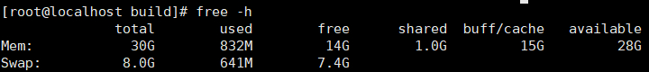
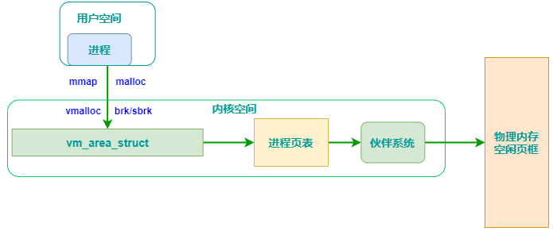
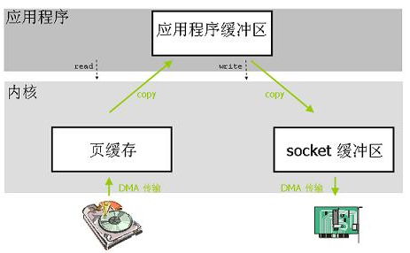
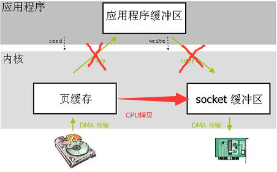

# linux 内存管理

## 系统内存
### 查看内存使用
```
free -h
```

- available：代表当前可以用的空闲内存，约等于 free + buff/cache。
- buff/cache：块设备读写缓冲区和文件系统的页缓存，buff/cache 可以降低磁盘IO，提高读写效率。当内存不足时，buff/cache 的数据会被系统回收，系统会比较内存和磁盘文件是否一致，不一致要回写磁盘文件，此时磁盘IO占用会很高。

#### 页缓存（page cache）
页缓存属于物理内存，是内核访问磁盘的高速缓存，应用程序读写文件时，都是直接访问页缓存，操作系统负责页缓存与磁盘文件的数据同步。

程序 read 文件时，内核先读取页缓存，如果没查到，则通过 DMA 的方式将数据从磁盘拷贝到页缓存，不占用 cpu。

程序 write 文件时，内核首先将数据拷贝到页缓存，并异步返回成，操作系统保证将脏页数据回写到磁盘（通过定时定量机制），关闭文件也不会触发刷新磁盘。

##### 清空页缓存
```
echo 1 > /proc/sys/vm/drop_cach
```
- 0：不释放（系统默认值）
- 1：释放页缓存
- 2：释放dentries和inodes
- 3：释放所有缓存


#### 页缓存异步刷新配置
```
sysctl -a | grep dirty
vm.dirty_background_bytes = 0
vm.dirty_background_ratio = 5
vm.dirty_bytes = 0
vm.dirty_expire_centisecs = 3000      # 表示脏数据多久会被刷新到磁盘上。这里的3000表示 30秒。
vm.dirty_ratio = 10                   # 当脏页占用的内存百分比超过此值时，内核会阻塞掉写操作，并开始刷新脏页。
vm.dirty_writeback_centisecs = 500    # 表示多久唤醒一次刷新脏页的后台线程。这里的500表示5秒唤醒一次。
```

#### swap 分区
swap 相当于 windows 下的虚拟内存，当内存不够时，通过 LRU 页面置换算法将暂时不用的内存先移到磁盘，把物理内存释放出来，当进程需要访问这些数据时，再从磁盘加载到内存。

swap 是为了解决物理内存不足时，用磁盘置换来腾出可用内存，频繁交换会降低系统性能。swap 不建议关闭，当关闭 swap 后，如果物理内存不足时，程序会因为内存不够而 crash。
```
# 查看swappiness参数
cat /proc/sys/vm/swappiness

# 修改swappingness参数
vim /etc/sysctl.conf  # 打开系统配置
vm.swappiness = 10    # 可用内存剩余10%时开启swap
sysctl -p             # 使生效

# 刷新释放swap空间
swapoff -a && swapon -a
```

## 物理内存
linux 通过分段和分页机制，把物理内存划分 4k 大小的内存页（也叫页框），物理内存的分配和回收都是基于页框进行。

### 内存碎片
#### 框外碎片
频繁的分配与回收物理页会导致大量小块内存夹杂在已分配的页框中间，形成框外碎片。

#### 框内碎片
一个物理页框大小4k，分配小内存也会占用一个页框，造成浪费，这就是内部碎片。

#### 伙伴系统
linux 采用伙伴系统（Buddy system）来解决框外碎片问题。

将空闲页框分组为 11 个块链表，每个块链表的块包含的连续页框个数依次为1,2，...1024，分配的时候寻找大小合适的块链表。

#### slab 分配器
slab 解决内核小对象分配太多产生的内部碎片问题。

slab 工作在伙伴系统之上，管理内核小对象，通过实现的缓存池，避免内部碎片；同时减少内存分配次数。

## 虚拟内存
虚拟内存解决多进程地址冲突问题，每个进程都可以拥有 2^64 的地址空间，虚拟内存也是按照 4k 大小划分成页（page）。

### 缺页中断
通过 malloc 分配的虚拟内存还没有分配物理内存，只有当访问时，产生缺页中断，才会通过伙伴系统和 slab 分配器申请物理内存。

### 页表
每个进程都有一个页表，保存虚拟内存到物理内存的映射。

### 进程内存模型
内存地址从高到底依次
- 内核空间：大小 1 G，用户程序不能直接访问，只能通过系统调用在内核态下可以访问。
- 用户栈：系统为每个线程分配一个 8M 的栈空间，栈上分配内存是从高地址向低地址分配。
- 文件映射区：通过 mmap() 分配的地址区，动态库也在这个区间，动态库只共享代码段，不共享数据段。
- 堆区：存储动态分配的内存，大小不固定。
- 读写数据段：通常已初始化的全局变量和局部静态变量被放在了读写数据段。
- 只读数据段：C 语言中的只读全局变量，程序中使用的字符串常量等会在编译时被放入到只读数据区。
- 代码段：程序的二进制代码

### 内存管理


linux 系统向用户提供申请的内存有 brk(sbrk) 和 mmap 函数。

#### brk/sbrk
两者的作用是扩展 heap 的上界 brk，也就是向上移动堆顶指针来分配内存。
```
#include <unistd.h>
int brk( const void *addr )  // 参数设置为新的brk上界地址，成功返回1，失败返回0；
void* sbrk ( intptr_t incr ) // 参数为申请内存的大小，返回heap新的上界brk的地址
```

#### mmap()
mmap 的第一种用法是映射文件到内存中；第二种用法是匿名映射，不映射磁盘文件，而向映射区申请一块内存。

#### malloc 内存分配器
glibc 提供了 malloc/free 函数来管理内存，为了提高分配效率，减少内存碎片，底层由 ptmalloc 分配器管理内存。

##### ptmalloc 内存结构
- chunk：内存分配单元，每个 chunk 有一个 8 字节的包头，包含了 chunk 的大小以及是否使用。
- bin：相似大小 chunk 的双向链表, ptmalloc 一共 维护了 128 个 chunk 大小范围不同 bin，并使用一个数组来存储。
- top chunk：当 bins 上都不能满足内存时，就会来 top chunk 上分配，通过 sbrk（主分区）和 mmap（非主分区）扩容。
- mmap chunk：申请内存超过 128k 时，需要 mmap 映射，则会放到 mmap chunk 上，free 时直接解除映射归还系统。

##### ptmalloc 分配流程
- 获取分配区的锁，一个进程有唯一一个主分区和多个非主分区。
- 从 bins 中找到一个满足的 chunk 返回，如果找不到 bins 内部会合并调整小的 chunk 来满足要求。
- 如果 bins 中没有合适的 chunk，则在 top chunk 上分配，如果大小不够，主分区通过 sbrk 扩容，非主分区通过 mmap 扩容。
- 申请内存大于 128k 时，通过 mmap 在 mmap chunk 上直接映射后分配。

#### 内存碎片
堆是从低地址往高地址增长，如果低地址的内存没有被释放，高地址的内存就不能被回收，容易产生内存碎片。

小内存块太多，且相邻内存块一直使用导致无法合并成大内存块，内存块因为太小，很难被再利用上，产生碎片。

内存碎片会导致系统变慢，内存碎片不可避免，只能尽量减少，避免使用小内存，尽量用内存池。

### 内存泄露
发生内存泄露时，通过 top 查看 Virt 虚拟内存占用会持续增长，Res 物理内存占用一般也相应的增长。
```
# 查看虚拟内存Vmsize大小
cat /proc/943/status |grep VmSize # 如果Vsize一直涨，说明存在泄露
```

#### 避免内存泄露
- 避免在堆上分配内存，尽量在栈上分配。
- 使用智能指针。

### mmap 内存映射
mmap 将磁盘文件直接映射到用户内存地址空间，用户程序可以像访问普通内存一样直接对文件进行访问。

#### read 原理
利用 read 系统调用读取文件时，需要经过以下步骤
- 通过文件路径在目录项中检索，找到对应的 inode，通过 inode 找到对应的页缓存树，查找页缓存节点。
- 页缓存节点存在，则直接返回，页缓存不存在，则产生缺页异常，由 DMA 负责将文件从磁盘加载到对应的页缓存。
- 将数据从页缓存复制到用户缓冲区对应的物理内存中，这个过程中需要 CPU 的全程干预。

#### mmap 原理
mmap 是在用户空间开辟一块虚拟内存，并映射到物理页缓存上，如果文件在页缓存中不存在，也不会拷贝文件到页缓存，而是在访问时通过缺页异常由 DMA 拷贝。

mmap 也是基于页缓存的，它有下面特点
- mmap 可以实现零拷贝，不需要像 read 系统调用一样将数据从内核页缓存拷贝到用户缓冲区对应的物理内存。
- 节省物理内存，多个进程通过 mmap 使用文件时，系统只会在页缓存中维护一份物理内存拷贝。
- 实现共享内存，多个进程访问文件时，映射的是同一块页缓存，可以共享数据。
- mmap 读文件也会产生缺页中断，顺序读场景下和 read 比效率差不多，随机读场景由于零拷贝，效率远高于 read 调用。
```
#include <sys/mman.h>

bool readFileMmap(const std::string& fileName) {
  int fd = open(fileName.c_str(), O_RDONLY);
  int len = lseek(fd, 0, SEEK_END);
  
  char *addr = (char *) mmap(NULL, len, PROT_READ, MAP_SHARED, fd, 0);
  madvise(addr, len, MADV_SEQUENTIAL);
  close(fd)
  
  // 直接访问 addr
  MemBuf memBuf(addr, len);
  std::istream in(&memBuf);
  long uid = 0;
  char str[LINE_BUF_SIZE] = {0};
  while(in.getline(str, LINE_BUF_SIZE)) {
      std::cout << str << std::endl;
  }
  munmap(addr, len); 
}
```

### 零拷贝
#### 用户态和内核态
执行系统调用时，会在用户态和内核态之间产生切换，带来 cpu 上下文切换开销，以及用户栈到内核栈的来回拷贝。

#### DMA
DMA 是直接存储器访问的缩写，是一种支持外部设备不通过 CPU 而直接与内存交换数据的接口技术。

DMA 解放了 CPU，让 CPU 可以去执行其他任务。

#### IO 操作
IO 操作涉及到内核缓冲区到用户缓冲区的拷贝，文件 IO 的内核缓冲区为页缓存，网络 IO 的内核缓冲区为 socket 缓冲区。

IO 读写操作需要经历 4 次内核切换，4 次数据拷贝，CPU 和 DMA 拷贝各2次。


#### 零拷贝技术
零拷贝是指避免将数据在内核缓冲区和用户缓冲区之间相互拷贝，从而减少用户空间和内核空间的上下文切换。

##### sendfile 函数
```
#include<sys/sendfile.h>
ssize_t senfile(int out_fd,int in_fd,off_t* offset,size_t count);
```
sendfile 函数支持两个文件描述符在内核中直接传输数据，从而实现零拷贝，效率很高。

sendfile 的 in_fd 必须是磁盘文件，out_fd 必须是 socket。



##### mmap 内存映射
mmap 将磁盘文件映射到用户虚拟内存空间上，不需要拷贝到用户空间，就可以直接进行读写。
mmap 只需要 3 次数据拷贝，DMA 2次，CPU 1次。
