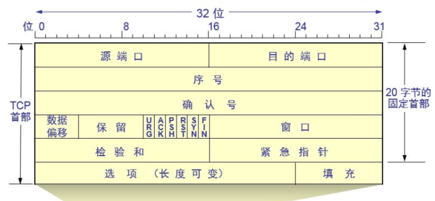
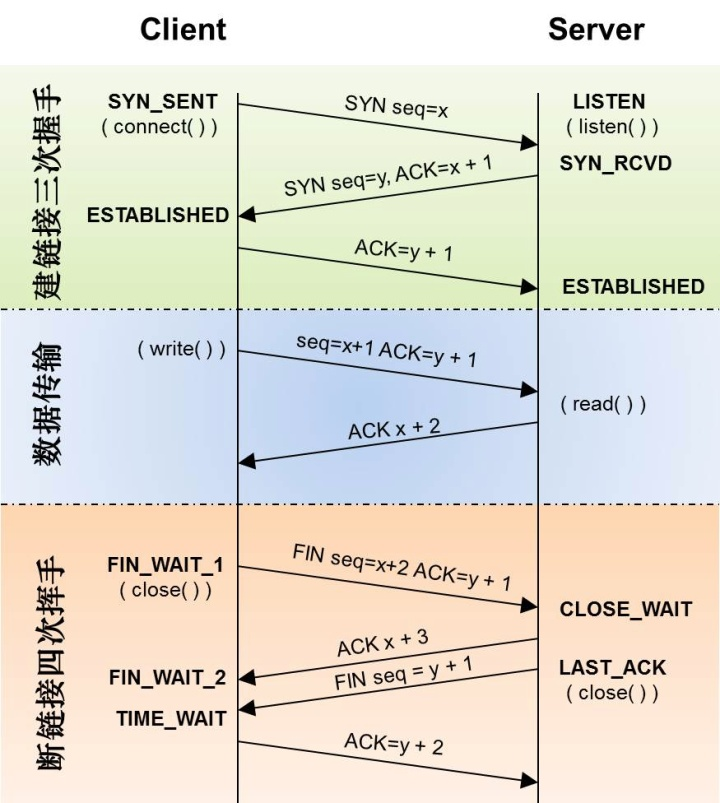

# TCP 可靠传输原理
## 概述
TCP 是传输层的协议，全称是叫做 Transmission Control Protocol。

### TCP 特点
- 面向连接：在数据传输之前，通信双方需要先建立一个可信的连接。
- 可靠传输：通过 ”ack 确认“和”超时重传“两种机制，保证消息的可靠送达。
- 流式传输：传输的数据不关心应用层的消息边界。
- 全双工：数据同时在两个方向上传输。

### TCP 连接
内核四元组来区分一个 TCP 连接，服务端 TCP 连接的源端口都是 listen 的端口，所以服务端连接不占用 listen 外的其他端口。
- 源IP
- 源端口
- 目标IP
- 目标端口

## TCP 数据包
#### TCP 的报文格式如下



#### 源端口
源端口表明发送端所使用的端口号，用于目标主机回应。

#### 目的端口
表明要连接的目标主机的端口号。

#### 序号
表明发送的数据包的顺序，一般为上次发送包中的顺序号+1，第一个 SYN 包的序号值是随机生成的。

#### 确认号
表明本端 TCP 已经接收到的数据，其值表示期待对端发送的下一个字节的序号，第一个 SYN 包的确认号一般为 0。

#### 数据偏移
表示 4 字节为单位的 TCP 报文的包头长度，用于确定用户数据区的起始位置。TCP 头部的大小为 20 字节，对应该值为 5。

#### 紧急标志位(URG)
开启时表明此数据包处于紧急状态应该优先处理

#### 确认标志位(ACK)
开启时表明确认号有效，否则忽略确认号

#### 推送标志位(PSH)
开启时表明应该尽快交付给应用进程，而不必等到缓存区填满才推送。

#### 复位标志位(RST)
开启时表明TCP连接出现错误，数据包非法拒绝连接。

#### 同步标志位(SYN)
建立连接的标志

#### 终止标志位(FIN)
开启时表明释放一个连接

#### 窗口大小
表明期望接受到的数据包字节数，用于拥塞控制。

#### 校验和
实现对TCP报文头以及数据区进行校验。

## TCP 工作流程


### 三次握手
三次握手的过程是，通信双方互相告知确认自己发送数据的序列号起始值（随机产生），序列号用来标识已发送的数据。

如果只是两次握手，至多只有连接发起方的起始序列号能被确认， 另一方选择的序列号则得不到确认。

#### sync 队列
服务端收到 syn 消息后进入 SYN-RECV 状态并等待客户端 ack，此时连接为半连接，会写入服务端的 sync 队列。

```
// 设置半连接队列的默认长度
echo 4096 > /proc/sys/net/ipv4/tcp_max_syn_backlog
```

#### syn flood 攻击
利用 TCP 三次握手的漏洞，短时间内向服务端发送大量 syn 包而不响应，那么服务器的 sync 队列很快会被写满，导致无法工作。

实现 syn flood 的手段，可以通过伪造源 IP 的方式，这样服务器的响应就永远到达不了客户端（握手无法完成）。

对 syn flood 实现拦截是比较困难的，最好的办法是通过专业的防火墙来解决。

#### accept 队列
服务端收到客户端的 ack 后，连接建立，连接放入 accept 队列，没有及时调用 accept 将连接取走，会导致队列溢出。

accept 队列的长度由内核配置和 listen 时 backlog 参数决定，取二者的最小值，默认 1024、
```
// 内核设置
echo 4096 > /proc/sys/net/core/somaxconn
```

### 四次挥手
在连接关闭时，由于 TCP 是全双工的，通信双方需要根据业务逻辑分别关闭各自发送端，所以需要四次挥手。

#### 半关闭状态
A 调用 close 关闭连接，而对端 B 没有调用 close 关闭，A 和 B 的连接就处于半关闭状态。
```
A -----FIN-----> B
FIN_WAIT_1       CLOSE_WAIT
A <----ACK------ B
FIN_WAIT_2
```

CLOSE_WAIT 状态的连接过多是不正常的，原因可能是出现了连接泄露 BUG，或者压力过大，来不及 close()。

#### TIME_WAIT 状态
A 调用 close 关闭连接，B 收到 FIN 后也调用 close 关闭连接，A 收到 B 的 FIN 后，会进入 TIME_WAIT 状态，并发送 ACK 给 B。
```
A -----FIN-----> B
FIN_WAIT_1       CLOSE_WAIT
A <----ACK------ B
FIN_WAIT_2

(B can send more data here, this is half-close state)

A <----FIN------ B
TIME_WAIT        LAST_ACK
A -----ACK-----> B
|                CLOSED
2MSL Timer
|
CLOSED
```

#### TIME_WAIT 详解
##### 保证连接正常释放
A 发送的 ACK 如果丢失，B 会重发 FIN，此时如果 A 的连接被关闭，TCP 传输层会返回 B 一个 RST 错误，影响关闭流程。维护一个 TIME_WAIT 状态可以重发 ACK，让对端 B 正常释放。

##### 避免旧数据包影响新连接
TCP 使用四元组来区分一个连接，如果 A 端不经过 TIME_WAIT 直接关闭，B 马上发起一个新的连接，新连接四元组和旧连接完全一样，TCP 无法区分新旧连接，这个时候网络中存在的旧数据包到来后会影响新的连接，而等待 TIME_WAIT 之后，可以保证新连接（相同四元组）建立后，网络中没有残存的旧数据包。

#### TIME_WAIT 持续时间
TIME_WAIT 状态持续 2MSL（1分钟），MSL（Max Segment Lifetime）是数据包在网络中传输的最大生命周期，默认 30 秒。

2MSL 时间到达后，连接会被关闭，此时如果又收到来自 B 的 FIN，则会返回 RST 错误，B 收到 RST 后关闭连接。

MSL 的大小可以根据网络状况设置，网络状态好时 MSL 可以设置短一点。

#### TIME_WAIT 危害
频繁主动关闭连接，会产生大量的 TIME_WAIT，这些连接仍占用文件描述符和少量内存（4K），如果是客户端还会占用1个本地端口。

##### 解决方案
可以使用长连接，避免连接的频繁关闭，还可以修改内核参数
```
net.ipv4.tcp_tw_reuse = 0    表示开启端口重用（只针对客户端connect有效）
net.ipv4.tcp_tw_recycle = 0  表示开启快速回收（慎用，在 NAT 环境下会出现丢包导致连接失败）
```
- 针对客户端，主要解决端口耗尽问题，可打开 tcp_tw_reuse 设置，不建议打开 tcp_tw_recycle，帮助不大。
- 作为服务端，主要是文件描述耗尽问题，没有什么办法解决，不建议打开 tcp_tw_recycle，除非确保服务器不是 NAT 网络。

#### RST 标记
RST 是一个特殊的标记，用来表示当前应该立即终止连接。以下这些情况都会产生RST：
- 向一个未被监听的端口发送数据
- 对方已经调用 close 关闭连接
- 存在一些数据未处理(接收缓冲区)，请求关闭连接时，会发送RST强制关闭
- 某些请求发生了超时

### 超时重传
超时重传是指在发送数据时，内核会设定一个定时器，当超过指定的时间，没有收到对方的 ACK 确认应答报文，就会重发该数据。

第一次发送后设置的超时时间是 1.5 秒，之后每次重传 2 倍递增，只到 64 秒，一共重传 12 次，大约 9 分钟才放弃重传

#### 快速重传
超时重传的问题是，超时等待的周期可能较长，发送效率太低。

快速重传是指，在定时器到来之前，通过接收端的 ack 确认信息来判定丢包，比如发送 1,2,3,4 四个包，2 丢了，则接收端在收到 1,3,4 后，都会返回序号 2 的 ack，发送端收到多个序号 2 的 ack，则判定 2 超时，则进行重发 2。

### 流量控制
流量控制是对通信双方点对点的控制，目的是让发送方的发送速率不要太快，让接收方来得及接收，避免分组丢失。

TCP 使用滑动窗口协议来实现流量控制，接收方返回的 ACK 中会包含本方接收窗口的大小，发送方根据接收窗口设置发送窗口的大小。

#### 滑动窗口
TCP 会话双方各自维护一个“发送窗口”和一个“接收窗口”。

接收窗口大小取决于应用、系统、硬件的限制（TCP 传输速率不能大于应用的数据处理速率），发送窗口则等于对方接收窗口大小。

### 拥塞控制
发送方可能因为网络拥塞导致发送失败，随后的重传会加重网络的拥塞，拥塞控制就是在网络阻塞时，尽量减少数据的发送。

发送方维持一个叫做拥塞窗口 cwnd 的状态变量，拥塞窗口的大小取决于网络的拥塞程度，并且动态变化。

发送窗口大小 = min（拥塞窗口大小，接受端接收窗口大小），每一轮都按发送窗口大小发送数据，然后调整 cwnd。

发送窗口只有收到对端对于本段发送窗口内字节的 ack，才会移动发送窗口的左边界。

接收窗口只有在前面所有的段都确认的情况下才会移动左边界。当在前面还有字节未接收但收到后面字节的情况下，窗口不会移动，并不对后续字节确认。以此确保对端会对这些数据重传。

#### 慢启动
发送方如果一次就将数据都发出去，如果网络环境很差，则会导致大量超时重传，所以拥塞控制在第一次发送数据时使用慢启动。

慢启动开始时 将 cwnd 设置为1，之后每收到一个 ack，就将 cwnd 加1，这样发送一轮下来 cwnd 就扩大了 2 倍。

为了防止 cwnd 增长过大引起网络拥塞，还需要设置一个慢启动门限 ssthresh 状态变量。
- 当 cwnd < ssthresh 时，使用上述的慢开始算法。
- 当 cwnd > ssthresh 时，停止使用慢开始算法而改用拥塞避免算法。

#### 拥塞避免
拥塞避免阶段，每发送一轮后 cwnd 加1，而不是 2 倍，使 cwnd 按线性规律缓慢增长，比慢启动的指数增长慢的多。

#### 快速重传
在超时重传中，只有等定时器超时才判定丢包并重传，而快速重传机制，实现了另外的一种丢包评定标准。

当连续收到 3 次序号重复的 ack，发送方就认为这个序号的包丢失了，立刻进行重传，不用等到定时器超时，提高了重传的效率。

#### 快速恢复
当连续收到 3 次序号重复的 ack 时，发送方虽然认定超时了，但是由于可以连续收到 3 个 ack，说明网络不是那么拥塞，所以并不进入慢启动阶段，而是将 cwnd 设置为 ssthresh 减半后的值，然后执行拥塞避免算法，使 cwnd 缓慢增大。

### nagle 算法
nagle 算法通过延迟发送，将小数据包积攒成一个 MSS（最大报文长度）后发送，减少包头冗余，充分利用带宽，避免拥塞。

nagle 算法虽然提高了网络吞吐量，但是实时性却降低了，在实时性强的应用中，可以设置 TCP_NODELAY 禁用 nagle 算法。

nagle 算法触发发送的规则
- 包长度达到 MSS
- 包含FIN
- 设置了 TCP_NODELAY
- 未设置 TCP_CORK 时，若所有发出去的小数据包（包长度小于MSS）均被确认，则允许发送
- 上述条件都未满足，但发生了超时（一般为 200ms），则立即发送。
 
 CORK 算法与 nagle 算法类似，都是积攒够一个 MTU 后才发送，区别是即使收到了 ack，也要延迟发送。

### 延迟确认机制
接收端延迟发送 ack 确认，在 40ms 内，如果有回复数据，捎带将上一个包的 ack 一并返回，如果 40ms 内没有消息返回，则发出 ack。

开启 TCP_QUICKACK 选项，可以关闭延迟确认机制。

如果发送端启用了 nagle 算法，在收到 ack 之前，不会发送数据，则导致发送端在发送时被阻塞，该问题对 http 或者 rpc 类的调用方式不会产生影响，因为 rpc 调用方式是 1 次发送对应 1 次接收，在收到对方回复数据之前，应用层不会再发送业务消息。

