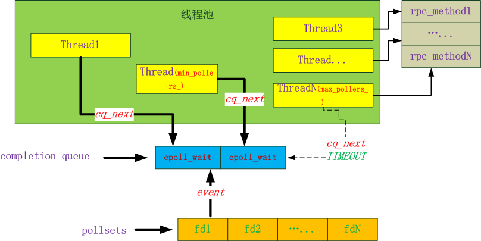

# 详解 gRPC 原理
## 什么是 RPC 
RPC（Remote Procedure Call）远程过程调用，用于分布式通信，可以像在本地一样远程调用另一个进程或者机器上的方法。

RPC 的核心内容有序列化、传输、消息模型。

### 序列化
由于网络只能传输字节，在 RPC 中，client 要传输一个对象给 server，需要将对象转换为字节，这个过程就叫序列化。

常用的序列化协议
- json：简洁，易读，语言无关，但是空间开销大，性能不好。
- protobuf：空间小，序列化和传输性能高，前向兼容，支持多语言，但是不易读。

### 传输
消息对象被序列化成字节后，需要通过 TCP 协议进行传输，涉及到传输协议，数据压缩等问题。

### 消息模型
消息模型是指 client 和 server 采用什么样的 IO 模型进行消息的发送和处理。

## gRPC 概述
gRPC 是 google 2015年份发布的开源 RPC 框架，使用 protobuf 生成接口代码并将消息序列化，并使用 http2.0 实现消息的高效传输。

### 特点
- 支持多种语言（C++，java，golang），多语言之间可以相互通信。
- 序列化性能好，支持参数向后兼容。
- 基于http2.0，单个连接可以多路复用。

gRPC 在不同语言版本上实现有差异，这里以 C++ 版为例说明。

### http2.0
http2.0 是最新版的 http 协议，主要解决 http1 的性能和安全问题，在四个方面做了优化。

#### 二进制传输
将 “head + body” 的消息结构，改成数个小片的二进制帧（head + data），解析和传输效率更高，非明文传输也更安全。

#### head 压缩
多个二进制帧的 head 信息会重复传输，采用 HPACK 方法对 head 消息建索引和压缩，减少重复传输。

#### 多路复用
一个 TCP 连接上可以同时发起多个请求，请求和响应的消息帧通过 stream id 进行标识，多路复用可以减少创建的连接数，减少资源占用。

#### 服务器推送
http2 改变传统的 “请求-应答” 模式，服务器不再是被动的响应请求，也可以新建 “流” 主动向客户端发送消息。

### gRPC 通信方式
#### 简单 RPC
就是普通的 RPC 调用，一次请求对应一次返回。
```
service HelloService {
    rpc Hello (String) returns (String); // 简单rpc，非流式
}
```

#### 流式 RPC
通过 steam 关键字定义，支持双向流式传输，多个请求可以对应多次返回。
```
service HelloService {
    rpc Channel (String) returns (stream String); // 单向流式，一次请求对应多次返回
    rpc Channel (stream String) returns (stream String); // 双向流式，多次请求对应多次返回
}
```
### 服务端消息模型
服务端底层采用 epoll 实现 IO 多路复用，会有多个 epoll 线程读取消息，封装成 request 对象，放入 CompletionQueue 队列。

服务端消息层从 CompletionQueue 队列中获取消息，并进行处理，这里有同步和异步两种服务。

#### 同步服务
采用线程池，线程分为 2 种，一种是专门用来处理 epoll 事件，另一种从 CompletionQueue 获取消息，并执行 RPC 请求。



#### 异步服务
需要用户自己为 server 创建 CompletionQueue 队列，并循环从 CompletionQueue 队列阻塞式的获取消息，然后执行 RPC 请求。

在 CQ 上调用 Next 方法循环获取请求和同步服务类似，只不过这是用户主动获取，同步服务中是框架的线程池来调用 Next。

```
  void Run() {
    std::string server_address("0.0.0.0:50051");

    ServerBuilder builder;
    // Listen on the given address without any authentication mechanism.
    builder.AddListeningPort(server_address, grpc::InsecureServerCredentials());
    // Register "service_" as the instance through which we'll communicate with
    // clients. In this case it corresponds to an *asynchronous* service.
    builder.RegisterService(&service_);
    // Get hold of the completion queue used for the asynchronous communication
    // with the gRPC runtime.
    cq_ = builder.AddCompletionQueue();
    // Finally assemble the server.
    server_ = builder.BuildAndStart();
    std::cout << "Server listening on " << server_address << std::endl;

    // Proceed to the server's main loop.
    HandleRpcs();
  }
  
  void HandleRpcs() {
    // Spawn a new CallData instance to serve new clients.
    new CallData(&service_, cq_.get());
    void* tag;  // uniquely identifies a request.
    bool ok;
    while (true) {
      // Block waiting to read the next event from the completion queue. The
      // event is uniquely identified by its tag, which in this case is the
      // memory address of a CallData instance.
      // The return value of Next should always be checked. This return value
      // tells us whether there is any kind of event or cq_ is shutting down.
      GPR_ASSERT(cq_->Next(&tag, &ok));
      GPR_ASSERT(ok);
      static_cast<CallData*>(tag)->Proceed();
    }
```

