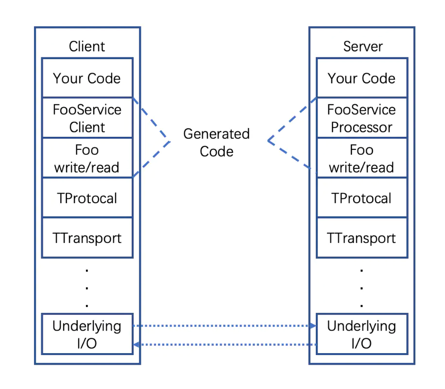

# Thrift 通信框架

## Thrift 简介
Thrift 是 Facebook 2007年开源的 RPC 通信框架，目前属于 Apache 开源项目。

Thrift 通过一个中间语言（IDL）来定义 RPC 的接口和数据类型，由编译器生成不同语言的代码，由这些自动生成的代码负责 RPC 协议层和传输层的实现。

## 架构原理
Thrift 的架构自下而上分为传输层（Transport），协议层（Protocol），服务层（client/server）。



### 传输（Transport）
处理消息在客户端和服务器端之间的通信传输，支持多种传输模式。
- TSocket：使用阻塞式I/O进行传输，也是最常见的模式。 
- TFramedTransport：使用非阻塞方式，按块的大小，进行传输，类似于Java中的NIO。  
- THttpTransport：采用Http传输协议进行数据传输              
- TFileTransport：顾名思义按照文件的方式进程传输，虽然这种方式不提供Java的实现，但是实现起来非常简单。 
- TZlibTransport：压缩后对数据进行传输，或者将收到的数据解压
- TNonblockingTransport-使用非阻塞方式，用于构建异步客户端。

### 协议（Protocol）
该组件负责对消息进行序列化/反序列化，支持多种协议，为节约带宽，提高传输效率，一般情况下使用二进制类型的传输协议。

支持的序列化协议有
- Binary：Thrift 提供的一种二进制编码，不可读，但是传输效率高，Thrift 默认都采用该序列化。
- Compact：另一种二进制编码，不同于 Binary 的地方是它对整数类型采用了压缩编码，更加节省传输空间，传输效率也更高。
- Json： 使用 JSON 的数据编码协议进行数据传输。 
- TDebugProtocol： 在开发的过程中帮助开发人员调试用的，以文本的形式展现方便阅读。

### 服务（Server）
定义了服务端的消息处理模型，主要有两种模型。

#### ThreadPoolServer
阻塞线程池模型，新连接到来时，从线程池分配线程，并在线程上阻塞读取消息，如果获取不到线程，则会排队等待。

适合服务端预先知道有多少个客户端并发，相应的设置线程池大小，保证请求都能被出来，性能非常高。

#### NonblockingServer
非阻塞线程池，底层利用 epoll + libevent 实现多路复用，线程池中的线程不用处理 recv 操作，完全被用来处理业务，这样允许在启用较少线程的情况下，可以处理大规模并发。

程序构建复杂，如果线程中存在较长IO等待，同样会影响其他连接的处理速度，如果 IO 多，性能反而不如阻塞线程池。

## 使用示例
### 编写idl文件
thrift 的工作原理就是根据 idl 描述文件来生成对应的源码文件，idl 文件中定义了服务器接口以及数据传输用到的数据结构。
```
struct qpair {
        1: string qkey,
        2: string qval,
}
struct QTerm {
        1: list<qpair> single_query,
        2: list<qpair> filter,
        3: list<i64> tags,
        4: list<i64> dnf,
}
struct Document {
        1:map<string, string> fields,
}
struct Query {
        1: required QTerm terms,
        2: required i32 start,
        3: required i32 length,
        4: optional string sortedby,
        5: optional list<string> results,
}
service thriftSearch {
        list<Document> search(
                1: Query q,
        )
}
```

### 编译生成源码
调用 thrift 程序来生成源码文件
```
/usr/local/thrift/bin/thrift -o ./AdIndexThrift/ --gen cpp ./AdIndexThrift/index.thrift
```

### 阻塞线程池代码
```
#include <thrift/server/TThreadedServer.h>
#include <thrift/server/TThreadPoolServer.h>
#include <thrift/concurrency/PosixThreadFactory.h>
int main(int argc, char **argv) {
  int port = 9090;
  shared_ptr<thriftSearchHandler> handler(new thriftSearchHandler());
  shared_ptr<TProcessor> processor(new thriftSearchProcessor(handler));       // 将消息处理对象绑定到帮定到一个Processor上去
  shared_ptr<TServerTransport> serverTransport(new TServerSocket(port));     // 生成一个传输通道，这里使用了Socket方式
  shared_ptr<TTransportFactory> transportFactory(new TBufferedTransportFactory()); // 生成一个传输工厂，主要用于把上面的transport转换成一个新的应用层传输通道
  shared_ptr<TProtocolFactory> protocolFactory(new TBinaryProtocolFactory());    // 定义了RPC的协议工厂，这里使用了二进制协议，你不可以使用别的协议，如JSON,Compact等

  // 加入多线程支持，生成一个线程池
  int multinum = 6144;    // 线程数目
  shared_ptr<ThreadManager> threadManager = ThreadManager::newSimpleThreadManager(multinum);
  shared_ptr<PosixThreadFactory> threadFactory = shared_ptr<PosixThreadFactory>(new PosixThreadFactory());
  threadManager->threadFactory(threadFactory);
  threadManager->start();

  // 创建server对象，这里是多线程阻塞模型,如果要使用多线程非阻塞，用TNonblockingServer类来创建
  TThreadPoolServer server(processor, serverTransport, transportFactory, protocolFactory, threadManager);
  server.serve();
  
  return 0;
}
```
