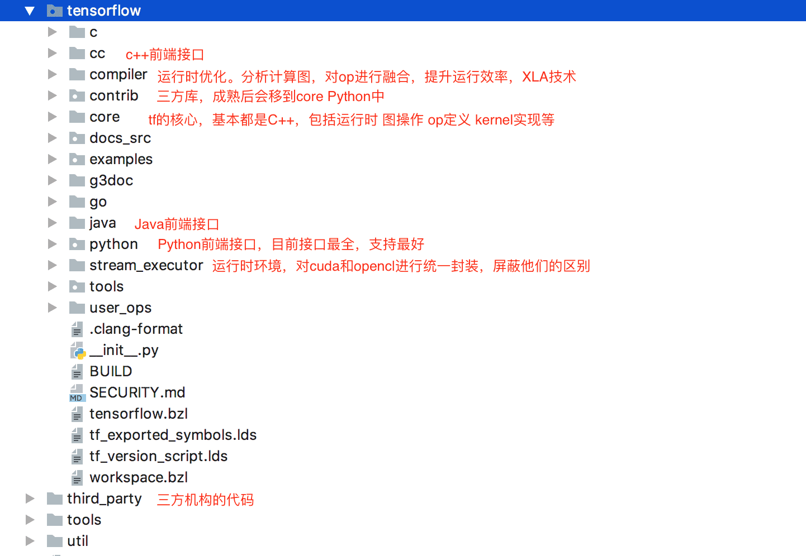

# tensorflow 运行原理
## 基础概念
Tensorflow 从字面看是 “tensor” 和 “flow” 的结合，翻译成中文就是 “张量” 和 “流” 。

Tensorflow 的运行机理大致为：用张量定义数据模型，把数据模型和操作定义在计算图中，然后使用会话运行计算。

### 张量
tensor（张量）实际上就是一个多维数组，相当于于 numpy 中的 array 。

在机器学习中，每个输入特征都是一个 tensor，多个输入特征构成一个 tensor 数组，多个输入 batch 又构成一个二维 tensor 数组。 

特征通过 one-hot 编码后，1个 tensor 就成一个1维数组（向量）。

#### 属性
每个 tensor 都包含下面四个属性
- name： 名称
- rank： 维度数
- shape: 各维度的长度
- type:  数据类型(float, string, int32, uint64)

#### 维度
Tensor 是向量和矩阵的扩展
- 0 阶 Tensor 代表标量，是一个单独的数
- 1 阶 Tensor 代表向量，是一个1维数组
- 2 阶 Tensor 代表矩阵，是一个2维数组
- 3 阶 Tensor 代表立方体，是一个3维数组

### 计算图
计算图用来表示计算任务，计算图是一种有向图，用来定义计算的结构，实际上就是一系列的函数的组合。

计算图中每个节点包含了运算函数，多个 Tensor 输入和一个 Tensor 输出，而连接节点的有向线段就是 Flow，表达了张量之间通过计算相互转化的过程。

### 会话
在计算图中，张量是没有数据的，只是存储了“计算方式”，tensorflow 需要发起一个会话去执行计算图，张量对象只有在会话中初始化，访问和保存。

#### 惰性计算
惰性计算是指当获取某个节点的输出结果时，Tensorflow 会从这个节点向前追溯，比如 Z = X + Y， 当获取节点 Z 的输出结果时，会先计算 Z 的两个输入节点 X 和 Y。

#### 占位符
计算图中节点的输入依赖于前一个节点的输出，但是起始节点的输入依赖于计算图中的原始输入，不依赖于任何前驱节点，但是其它节点依赖它，tf 提供了占位符（placeholder）先将位置占住，
然后在执行的时候再将原始数据输入。

#### feed_dict
feed_dict 是 session.run() 的第二个传入参数，用来给图中的张量传值，feed_dict 必须与 tf.placeholder 搭配使用。 

### 代码示例
```
import tensorflow as tf
import numpy as np
import matplotlib.pyplot as plt
 
#创建占位符
X = tf.placeholder(tf.float32)
Y = tf.placeholder(tf.float32)
 
#创建变量
w = tf.Variable(tf.random_normal([1], name='weight'))
b = tf.Variable(tf.random_normal([1], name='bias'))

#定义输出结果
y_predict = tf.sigmoid(tf.add(tf.multiply(X, w), b))

#定义损失函数
cost=tf.reduce_sum(tf.pow(y_predict-Y,2.0))/400
 
#创建优化器
optimizer=tf.train.AdamOptimizer().minimize(cost)
 
#创建session，执行训练
num_epoch=500
cost_accum=[]
cost_prev=0
#np.linspace（）创建agiel等差数组，元素个素为num_samples
xs=np.linspace(-5,5,num_samples)
ys=np.sin(xs)+np.random.normal(0,0.01,num_samples)
 
with tf.Session() as sess:
    #初始化所有变量
    sess.run(tf.initialize_all_variables())
    #开始训练
    for epoch in range(num_epoch):
        for x,y in zip(xs,ys):
            sess.run(optimizer,feed_dict={X:x,Y:y})
        train_cost=sess.run(cost,feed_dict={X:x,Y:y})
        cost_accum.append(train_cost)
        print("train_cost is:",str(train_cost)) 
 
        #当误差小于10-6时 终止训练
        if np.abs(cost_prev-train_cost)<1e-6:
            break
        #保存最终的误差

```
## 详细设计
### 系统架构


整个框架以 C API 为界，分为前端和后端两大部分
- 前端：提供编程模型，多语言的接口支持，比如 Python， Java， C++ 等，通过 C API 建立前后端的连接。
- 后端：提供运行环境，完成计算图的执行，由 C++ 实现。

后端进一步分为 4 层
- 运行时：分为分布式运行时和本地运行时，负责计算图的接收，构造，编排等。
- 计算层：提供各 op 算子的内核实现，例如 conv2d, relu等。
- 通信层：实现组件间数据通信，基于 gRPC 和 RDMA 两种通信方式。
- 设备层：提供多种异构设备的支持，如 CPU GPU TPU FPGA 等。

### 源码结构
tensorflow 源码按照框架分层来组织文件


core 为核心实现

