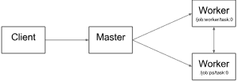

# tensorflow 运行原理
## 基础概念
Tensorflow 从字面看是 “tensor” 和 “flow” 的结合，翻译成中文就是 “张量” 和 “流” 。

Tensorflow 的运行机理大致为：用张量定义数据模型，把数据模型和操作定义在计算图中，然后使用会话运行计算。

### 张量
tensor（张量）实际上就是一个多维数组，相当于于 numpy 中的 array 。

在机器学习中，每个输入特征都是一个 tensor，多个输入特征构成一个 tensor 数组，多个输入 batch 又构成一个二维 tensor 数组。 

特征通过 one-hot 编码后，1个 tensor 就成一个1维数组（向量）。

#### 属性
每个 tensor 都包含下面四个属性
- name： 名称
- rank： 维度数
- shape: 各维度的长度
- type:  数据类型(float, string, int32, uint64)

#### 维度
Tensor 是向量和矩阵的扩展
- 0 阶 Tensor 代表标量，是一个单独的数
- 1 阶 Tensor 代表向量，是一个1维数组
- 2 阶 Tensor 代表矩阵，是一个2维数组
- 3 阶 Tensor 代表立方体，是一个3维数组

### 计算图
计算图用来表示计算任务，计算图是一种有向图，用来定义计算的结构，实际上就是一系列的函数的组合。

计算图中每个节点包含了运算函数，多个 Tensor 输入和一个 Tensor 输出，而连接节点的有向线段就是 Flow，表达了张量之间通过计算相互转化的过程。

### 会话
在计算图中，张量是没有数据的，只是存储了“计算方式”，tensorflow 需要发起一个会话去执行计算图，张量对象只有在会话中初始化，访问和保存。

#### 惰性计算
惰性计算是指当获取某个节点的输出结果时，Tensorflow 会从这个节点向前追溯，比如 Z = X + Y， 当获取节点 Z 的输出结果时，会先计算 Z 的两个输入节点 X 和 Y。

#### 占位符
计算图中节点的输入依赖于前一个节点的输出，但是起始节点的输入依赖于计算图中的原始输入，不依赖于任何前驱节点，但是其它节点依赖它，tf 提供了占位符（placeholder）先将位置占住，
然后在执行的时候再将原始数据输入。

#### feed_dict
feed_dict 是 session.run() 的第二个传入参数，用来给图中的张量传值，feed_dict 必须与 tf.placeholder 搭配使用。 

### 代码示例
```
import tensorflow as tf
import numpy as np
import matplotlib.pyplot as plt
 
#创建占位符
X = tf.placeholder(tf.float32)
Y = tf.placeholder(tf.float32)
 
#创建变量
w = tf.Variable(tf.random_normal([1], name='weight'))
b = tf.Variable(tf.random_normal([1], name='bias'))

#定义输出结果
y_predict = tf.sigmoid(tf.add(tf.multiply(X, w), b))

#定义损失函数
cost=tf.reduce_sum(tf.pow(y_predict-Y,2.0))/400
 
#创建优化器
optimizer=tf.train.AdamOptimizer().minimize(cost)
 
#创建session，执行训练
num_epoch=500
cost_accum=[]
cost_prev=0
#np.linspace（）创建agiel等差数组，元素个素为num_samples
xs=np.linspace(-5,5,num_samples)
ys=np.sin(xs)+np.random.normal(0,0.01,num_samples)
 
with tf.Session() as sess:
    #初始化所有变量
    sess.run(tf.initialize_all_variables())
    #开始训练
    for epoch in range(num_epoch):
        for x,y in zip(xs,ys):
            sess.run(optimizer,feed_dict={X:x,Y:y})
        train_cost=sess.run(cost,feed_dict={X:x,Y:y})
        cost_accum.append(train_cost)
        print("train_cost is:",str(train_cost)) 
 
        #当误差小于10-6时 终止训练
        if np.abs(cost_prev-train_cost)<1e-6:
            break
        #保存最终的误差

```
## 详细设计
### 系统架构


整个框架以 C API 为界，分为前端和后端两大部分
- 前端：提供编程模型，多语言的接口支持，比如 Python， Java， C++ 等，通过 C API 建立前后端的连接。
- 后端：提供运行环境，完成计算图的执行，由 C++ 实现。

后端进一步分为 4 层
- 运行时：分为分布式运行时和本地运行时，负责计算图的接收，构造，编排等。
- 计算层：提供各 op 算子的内核实现，例如 conv2d, relu等。
- 通信层：实现组件间数据通信，基于 gRPC 和 RDMA 两种通信方式。
- 设备层：提供多种异构设备的支持，如 CPU GPU TPU FPGA 等。

### 源码结构
tensorflow 源码按照框架分层来组织文件


core 为核心实现


### 计算过程

#### 图传递
- 前端 client 开启 session，通过它建立和后端 master 之间的连接。
- 执行 session.run()，将构造好的计算图（graph）序列化为 graphDef 后，以 protobuf 的格式传递给 master。

#### 图剪枝
- master 根据 session.run() 传递的 fetches 和 feeds 列表，反向遍历全图，进行剪枝，得到最小依赖子图。

#### 图分裂
- master 将最小子图分裂为多个 Graph Partition，并注册到多个 worker 上，一个 worker 对应一个 Graph Partition。

#### 图二次分裂
- worker 根据当前可用硬件资源，如 CPU GPU，将 Graph Partition 按照 op 算子设备约束规范（例如tf.device(’/cpu:0’)，二次分裂到不同设备上。

#### 图运行
- 对于每一个计算设备，worker 依照 op 在 kernel 中的实现，完成 op 的运算。
- 设备间数据通信可以使用 send/recv 节点，而 worker 间通信，则使用 GRPC 或 RDMA 协议。

### 模型使用
离线训练得到一个模型文件，要使用这个模型进行预测，则涉及到模型的加载和调用，这里分析下 C++ 接口下的实现。

#### 模型加载
模型加载 API 定义在 tensorflow/cc/loader.h 中，通过调用 LoadSavedModel 返回一个 SavedModelBundle 对象。

SavedModelBundle 对象加载了模型的计算图和参数，并创建一个 session 负责调用。

##### 加载过程
- 将模型目录下的 saved_model.pb 文件，解析成 proto 对象，得到计算图 MetaGraphDef。
- 为计算图创建一个 session，如果 SessionOptions.target 为空则创建单机版，否则创建分布式版。
- 加载模型目录下 variables 变量参数。

#### 模型调用
通过 session.run 调用模型，传入参数有
- inputs：输入参数，是一个 pair<name, tensor> 数组，每个元素对应一类特征，用 name 标识。
- output_names：要调用的方法列表，是一个 string 数组，每个元素代表一个方法名。
- outputs：输出结果，是一个 tensor 数组，和 output_names 定义的方法一一对应。
- run_metadata：定义运行元信息，记录训练运算时间和内存占用等信息。
- threadpool_options：自定义的线程池。

### 并行计算
同一个 session 下，为了快速计算需要将 op 进行并行计算，而对单机版来说就是使用多线程并行，也就是线程池。

tensorflow 支持三种 session 和线程池的关系，在初始化 session 的时候会根据 SessionOptions.config 不同配置来设置。
- 单个 session 设置多个线程池：创建多个线程池，如果线程池的 global_name 为空，代表是自己 owned 的需要自己关闭。
- 单个 session 设置单个线程池：为 session 生成独立的线程池，需要自己关闭。
- 多个会话共享线程池：默认配置，所有 session 共享一个线程池。

默认情况下，tensorflow 所有 session 公用一个全局的线程池，可以在 session.run 中传入自定义的线程池提高并发性能。

线程池大小由 SessionOptions.config 设置，如果没有设置，默认为 cpu 的核数。
